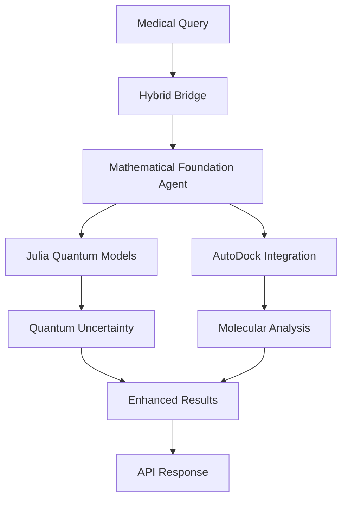

# Mathematical Foundation Integration

## Overview

The mathematical foundation integration connects Julia quantum models and AutoDock visualization to the core PremedPro AI system, providing enhanced uncertainty quantification and molecular analysis capabilities.

## Architecture Components

### 1. Julia Mathematical Foundation (`math_foundation/`)

**Core Modules:**
- `qft_qm.jl` - Quantum Field Theory and Quantum Mechanics analogs
- `thermo_entropy.jl` - Thermodynamic entropy calculations
- `python_wrapper.py` - Python interface for Julia modules

**Key Capabilities:**
- Quantum uncertainty quantification
- Thermodynamic entropy analysis
- Field evolution modeling
- Truth probability calculations

### 2. AutoDock Integration (`math_foundation/autodock_integration.py`)

**Core Features:**
- Molecular docking analysis
- Virtual screening capabilities
- Binding affinity prediction
- Visualization components (AutoDock Vis)

### 3. Mathematical Foundation Agent (`core/medical_agents/mathematical_foundation_agent.py`)

**Agent Capabilities:**
- Quantum uncertainty quantification
- Molecular docking analysis
- Thermodynamic entropy calculation
- Field evolution modeling

**Integration Points:**
- Hybrid reasoning bridge
- Medical query processing
- Confidence enhancement
- Uncertainty bounds calculation

### 4. Hybrid Bridge Enhancement (`core/hybrid_bridge.py`)

**Enhanced Features:**
- Mathematical foundation initialization
- Quantum uncertainty integration
- Molecular analysis integration
- Enhanced uncertainty bounds calculation

### 5. API Integration (`api/routes/mathematical_foundation.py`)

**Available Endpoints:**
- `GET /api/v1/mathematical-foundation/status` - System status
- `POST /api/v1/mathematical-foundation/quantum-analysis` - Quantum analysis
- `POST /api/v1/mathematical-foundation/molecular-analysis` - Molecular analysis
- `POST /api/v1/mathematical-foundation/thermodynamic-analysis` - Thermodynamic analysis
- `POST /api/v1/mathematical-foundation/comprehensive-analysis` - Comprehensive analysis
- `GET /api/v1/mathematical-foundation/capabilities` - Available capabilities
- `GET /api/v1/mathematical-foundation/configuration` - Configuration

### 6. Configuration System (`config/mathematical_foundation.yaml`)

**Configuration Sections:**
- Julia integration settings
- AutoDock integration settings
- Hybrid bridge integration
- System integration points
- Error handling and fallbacks

## Integration Flow



## Usage Examples

### 1. Quantum Uncertainty Quantification

```python
from core.medical_agents.mathematical_foundation_agent import create_mathematical_foundation_agent

# Create agent
agent = create_mathematical_foundation_agent()

# Analyze quantum uncertainty
query = "What is the uncertainty in this medical diagnosis?"
context = {"confidence": 0.7}
result = agent._apply_quantum_analysis(query, context)

print(f"Quantum Uncertainty: {result.get('quantum_uncertainty', 0.0)}")
```

### 2. Molecular Docking Analysis

```python
# Analyze molecular interactions
query = "Analyze the binding affinity of this drug molecule"
context = {"ligand_smiles": "CC(=O)OC1=CC=CC=C1C(=O)O"}
result = agent._apply_molecular_analysis(query, context)

print(f"Binding Affinity: {result.get('binding_affinity_estimate', 0.0)}")
```

### 3. API Usage

```bash
# Get system status
curl -X GET "http://localhost:8000/api/v1/mathematical-foundation/status"

# Perform quantum analysis
curl -X POST "http://localhost:8000/api/v1/mathematical-foundation/quantum-analysis" \
  -H "Content-Type: application/json" \
  -d '{"query": "What is the uncertainty?", "confidence": 0.7}'

# Perform comprehensive analysis
curl -X POST "http://localhost:8000/api/v1/mathematical-foundation/comprehensive-analysis" \
  -H "Content-Type: application/json" \
  -d '{"query": "Analyze this medical data", "confidence": 0.8}'
```

## Configuration

### Julia Integration

```yaml
mathematical_foundation:
  julia:
    enabled: true
    julia_path: null  # Auto-detect
    modules:
      - "qft_qm.jl"
      - "thermo_entropy.jl"
    quantum_models:
      hbar_analog: 1.0
      uncertainty_principle_enabled: true
      quantum_entropy_enabled: true
```

### AutoDock Integration

```yaml
mathematical_foundation:
  autodock:
    enabled: true
    vina_executable: "vina"
    visualization_enabled: true
    docking:
      exhaustiveness: 8
      num_modes: 9
      energy_range: 3
```

## Testing

Run the integration test:

```bash
python examples/mathematical_foundation_integration_test.py
```

This will test:
1. Mathematical foundation agent
2. Hybrid bridge integration
3. API endpoints
4. Configuration loading
5. Capabilities demonstration

## Error Handling

The system includes comprehensive error handling:

- **Julia Unavailable**: Falls back to Python implementations
- **AutoDock Unavailable**: Uses mock molecular analysis
- **Quantum Calculation Failure**: Falls back to classical uncertainty
- **Configuration Errors**: Uses default settings

## Performance Considerations

- **Lazy Loading**: Components initialize only when needed
- **Fallback Mechanisms**: System continues operation even if components fail
- **Timeout Protection**: Prevents hanging on complex calculations
- **Resource Management**: Efficient memory and CPU usage

## Future Enhancements

1. **Real-time Visualization**: Interactive molecular docking visualization
2. **Advanced Quantum Models**: More sophisticated quantum algorithms
3. **Machine Learning Integration**: ML-enhanced uncertainty quantification
4. **Distributed Computing**: Parallel processing for large-scale analysis
5. **Real-time Collaboration**: Multi-user mathematical foundation sessions

## Troubleshooting

### Common Issues

1. **Julia Not Found**
   - Install Julia: https://julialang.org/downloads/
   - Install PyJulia: `pip install julia`

2. **AutoDock Not Available**
   - Install AutoDock Vina: http://vina.scripps.edu/
   - Ensure `vina` executable is in PATH

3. **Configuration Errors**
   - Check `config/mathematical_foundation.yaml`
   - Verify file permissions and syntax

4. **Import Errors**
   - Ensure all dependencies are installed
   - Check Python path configuration

### Debug Mode

Enable debug logging:

```python
import logging
logging.basicConfig(level=logging.DEBUG)
```

## Conclusion

The mathematical foundation integration provides a robust, scalable system for enhanced medical AI reasoning with quantum uncertainty quantification and molecular analysis capabilities. The system is designed to gracefully handle component failures while providing maximum functionality when all components are available. 