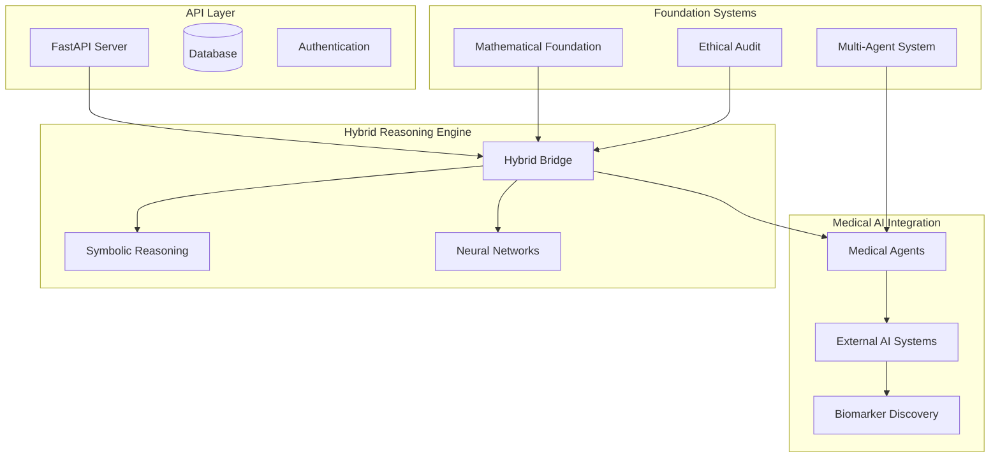
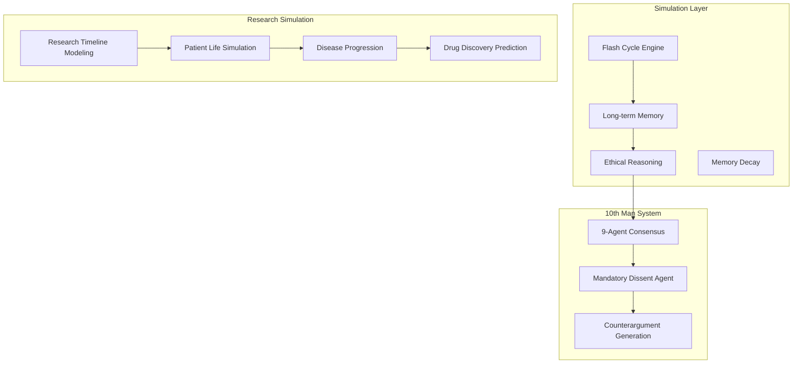

# Medical Research Neuro-Symbolic AI

A hybrid neuro-symbolic AI framework for medical research analysis, focusing on neurodegeneration research and clinical data processing for Parkinson's, ALS, and Alzheimer's disease.

[](https://choosealicense.com/licenses/mit/)
[](https://www.python.org/downloads/)
[]()
[](https://github.com/BhodiSea/Medical-Research-Neuro-Symbolic-AI/stargazers)
[](https://github.com/BhodiSea/Medical-Research-Neuro-Symbolic-AI/network)
[](https://github.com/BhodiSea/Medical-Research-Neuro-Symbolic-AI/graphs/contributors)

## Summary

**Purpose**: Hybrid neuro-symbolic AI framework for medical research analysis, combining rule-based logical reasoning with machine learning pattern recognition  
**Domain**: Neurodegeneration research (Parkinson's disease, ALS, Alzheimer's disease)  
**Status**: Architectural framework with production-ready infrastructure; AI components require functional implementation  
**Architecture**: Multi-agent deliberation system with mandatory dissent mechanism to reduce consensus bias  
**Scope**: Research support only; not intended for clinical diagnosis or patient care  
**Installation**: `git clone --recursive [repo] && pip install -r requirements-api.txt && python run_api.py`

## Ethical Framework

**Research Ethics and Safety Measures**

• **Privacy Protection**: HIPAA-compliant differential privacy implementation with mathematical guarantees
• **Medical Safety**: Research support only; excludes diagnostic recommendations and clinical decision-making
• **AI Oversight**: Multi-agent deliberation with mandatory dissent mechanism to reduce consensus bias
• **Transparency**: Complete audit trails with explainable reasoning pathways
• **Simulation Constraints**: Mathematical limits on computational modeling to prevent emergence of consciousness
• **Human Oversight**: Medical professionals maintain authority over all system outputs
• **Bias Monitoring**: Continuous assessment of fairness across demographic groups
• **IRB Compliance**: Adherence to institutional review board standards for human subjects research
• **Peer Review**: All generated insights require independent validation through established scientific processes

## Table of Contents

- [System Architecture](#system-architecture)
- [Why Medical Research AI?](#why-medical-research-ai)
- [Vision and Goals](#vision-and-goals)
- [Project Status](#project-status)
- [Key Features](#key-features)
- [Installation](#installation)
- [Dependencies](#dependencies)
- [Quick Start](#quick-start)
- [Demo](#demo)
- [Development Roadmap](#development-roadmap)
- [Contributing](#contributing)
- [FAQ & Troubleshooting](#faq--troubleshooting)
- [Community & Support](#community--support)
- [Ethical Guardrails Snapshot](#-ethical-guardrails-snapshot)
- [Ethical Framework & Disclaimers](#ethical-framework--disclaimers)
- [License](#license)
- [Changelog](#changelog)

## System Architecture

### Overview Diagram



### Core Architecture Layers

| Layer | Components | Status | Key Technologies |
|-------|------------|--------|------------------|
| **🌐 API Layer** | FastAPI, Database, Auth | ✅ Production-Ready | FastAPI, SQLAlchemy, Pydantic |
| **🧠 Reasoning Engine** | Hybrid Bridge, Symbolic/Neural | ⚠️ Framework-Ready | PyTorch, NSTK, Nucleoid |
| **⚕️ Medical AI** | Agents, External Systems | ⚠️ Integration-Ready | TorchLogic, SymbolicAI, RDKit |
| **🔢 Mathematical** | Quantum Models, Statistics | ⚠️ Framework-Complete | Julia, PyJulia, NumPy |
| **⚖️ Ethics & Safety** | Audit System, Privacy | ⚠️ Architecture-Complete | Rust, HolisticAI, Differential Privacy |
| **🤖 Orchestration** | Multi-Agent, Coordination | ⚠️ Wrapper-Ready | OpenSSA, CrewAI, AIWaves |
| **🎭 Simulation Engine** | Flash Cycles, Memory Decay | 🔴 Conceptual | Custom, Mem0, Julia Integration |
| **🎯 10th Man System** | Consensus, Dissent, Counter-args | ⚠️ Mock-Implemented | Multi-Agent, Ethical Reasoning |
| **⏱️ Research Acceleration** | Timeline Modeling, Predictions | 🔴 Visionary | QM/QFT Models, Thermodynamics |

<details>
<summary><strong>📊 Data Flow Architecture (Click to expand)</strong></summary>

**Research Query Processing Pipeline**:
1. **Input Validation** → Query sanitization and safety checks
2. **Strategy Selection** → Adaptive reasoning mode (symbolic_first/neural_first/parallel)
3. **10th Man Activation** → Multi-agent deliberation with mandatory dissent
4. **Simulation Initialization** → Internal research timeline modeling when applicable
5. **Parallel Processing** → Simultaneous symbolic and neural analysis
6. **Result Fusion** → Weighted combination with confidence scoring
7. **Ethical Validation** → Safety and compliance verification through audit system
8. **Response Generation** → Structured output with uncertainty quantification
9. **Audit Logging** → Complete decision trail for transparency

**Internal Simulation Architecture**:


</details>

## Why Medical Research AI?

**The Challenge**: Medical research, particularly in neurodegeneration, typically takes decades from hypothesis to treatment. Diseases like Parkinson's, ALS, and Alzheimer's affect millions while traditional research methods struggle with:
- Complex multi-modal data integration (genetic, proteomic, clinical, imaging)
- Lengthy clinical trial processes with high failure rates
- Siloed research approaches limiting cross-disease insights
- Limited ability to process vast literature and identify novel connections

**Our Solution**: A hybrid neuro-symbolic AI that combines:
- 🧠 **Symbolic reasoning** (rule-based logic, like clinical guidelines) for medical safety and interpretability
- 🤖 **Neural networks** (machine learning models) for pattern recognition in complex biological data
- ⚖️ **Ethical oversight** ensuring responsible medical AI development
- 🔬 **Multi-agent coordination** for comprehensive research analysis

**Unique Capabilities**:
- **10th Man System**: Multi-agent deliberation mechanism that prevents groupthink through mandatory dissent
- **Internal Simulation Training**: Agents develop ethical reasoning through simulated human-like experiences
- **Research Timeline Modeling**: Computational modeling of research timelines using quantum-inspired approaches
- **Emergent Morality Framework**: Ethics developed through experiential learning rather than hard-coded rules
- Adaptive reasoning modes based on query sensitivity and complexity
- Integration of 30+ specialized AI systems for medical research
- Mathematical foundation using quantum-inspired uncertainty modeling
- Comprehensive ethical audit system with differential privacy

## Vision and Goals

### Primary Mission

Support medical research analysis through AI-assisted data processing and pattern recognition for neurodegeneration diseases while maintaining ethical and safety standards.

### Target Outcomes

| Research Area | Current Timeline | Target Acceleration | Success Metrics |
|---------------|------------------|-------------------|-----------------|
| **Biomarker Discovery** | 5-10 years | 6-12 months | 7+ year early detection capability |
| **Drug Repurposing** | 10-15 years | Target: 1-2 years | Safety prediction modeling |
| **Clinical Trial Design** | 2-5 years | Target: 2-6 months | Trial optimization support |
| **Literature Synthesis** | 6-12 months | Target: 1-2 weeks | Comprehensive literature analysis |

### Strategic Approach

**Hybrid Neuro-Symbolic Architecture**: Combines interpretable symbolic reasoning with powerful pattern recognition, ensuring medical safety while maximizing discovery potential.

**Multi-Agent Deliberation**: Domain expert agents collaborate with devil's advocate systems to prevent groupthink and ensure comprehensive analysis.

**Ethical-First Design**: Built-in privacy protection, bias detection, and safety monitoring with complete decision traceability.

## Project Status

**Current Stage**: Architectural framework with production-ready infrastructure components

**Implementation Status**: The codebase provides a comprehensive framework with established design patterns, safety mechanisms, and integration interfaces for multiple AI systems. Core functionality currently exists as mock implementations requiring connection to functional AI components.

### Implemented Components

- **API Infrastructure**: FastAPI application with middleware, security headers, rate limiting, and error handling
- **Database Layer**: SQLAlchemy models with repository patterns and migrations
- **Reasoning Architecture**: Bridge framework supporting multiple reasoning modes (symbolic_first, neural_first, parallel, adaptive)
- **Agent Integration Framework**: CrewAI wrapper with multi-agent deliberation system and memory management interfaces
- **Mathematical Foundation**: Julia/Python integration framework with uncertainty modeling and entropy calculation modules
- **Safety Layer**: Rust-based audit system with consciousness detection, privacy enforcement, and compliance monitoring
- **Configuration Management**: YAML-based ethical constraints, simulation parameters, and agent specializations
- **Development Infrastructure**: Testing frameworks, code quality tools, and contribution guidelines

### Implementation Requirements

**Phase 1: Core AI Integration**
- Replace mock implementations in hybrid reasoning bridge (core/hybrid_bridge.py:141-174)
- Connect existing AI submodules (SymbolicAI, TorchLogic, Nucleoid, Mem0)
- Implement functional neural-symbolic fusion with confidence scoring
- Deploy multi-agent deliberation system

**Phase 2: Mathematical & Safety Integration**
- Activate Julia mathematical foundation for uncertainty quantification
- Deploy Rust ethical audit system with Python bindings
- Implement consciousness detection and privacy enforcement
- Connect uncertainty modeling and entropy calculation frameworks

**Phase 3: Knowledge & Memory Systems**
- Populate medical knowledge graph with UMLS/SNOMED CT ontologies
- Implement agent memory persistence and decay mechanisms
- Deploy differential privacy protection and bias monitoring
- Create audit trails and decision transparency

## System Capabilities

### Neurodegeneration Research Support

**Protein Analysis & Drug Discovery**:
- Alpha-synuclein aggregation modeling (Parkinson's)
- SOD1 mutation analysis and gene therapy targets (ALS)
- Amyloid-beta processing and clearance mechanisms (Alzheimer's)
- Multi-target therapeutic approach across diseases

**Biomarker Discovery Pipeline**:
- Disease progression and therapeutic response monitoring
- Multi-modal data integration (genetic, proteomic, imaging, clinical)
- Statistical validation and regulatory preparation support

### Clinical Research Analysis

**Literature Analysis & Synthesis**:
- Automated systematic reviews and meta-analyses
- Evidence quality assessment and bias detection
- Novel hypothesis generation from literature gaps
- Real-time trend analysis and pattern identification

**Research Data Analytics**:
- Cross-study data harmonization and integration
- Hidden pattern recognition in complex medical datasets
- Causal inference modeling and predictive analytics
- Novel statistical method development and validation

### Hybrid AI Reasoning

**Symbolic Medical Reasoning**:
- Medical knowledge graphs and rule-based diagnosis support
- Clinical guideline adherence and safety validation
- Contraindication checking and causal reasoning
- Interpretable decision pathways for medical professionals

**Neural Pattern Recognition**:
- Medical imaging analysis (radiology, pathology, microscopy)
- Genomic pattern detection and variant interpretation
- Clinical data mining and outcome prediction
- Uncertainty quantification with confidence intervals

### Multi-Agent Architecture

**Deliberation System**:
- Multi-agent consensus with mandatory dissent mechanism
- Specialized domain experts (medical ethics, biology, pharmacology)
- Counterargument generation to reduce consensus bias
- Research hypothesis validation with dissenting perspectives
- Integration with ethical audit layer for safety assurance

**Agent Training Framework**:
- Computational simulation environments for ethical reasoning development
- Progressive training phases (ethics → domain knowledge)
- Memory formation through simulated ethical scenarios
- Configurable ethical constraints and behavioral limits
- Persistent memory storage with decay mechanisms

**Research Modeling Capabilities**:
- Computational modeling of research timelines and pathways
- Disease progression modeling using thermodynamic principles
- Drug candidate prediction through scenario analysis
- Branching pathway analysis using mathematical modeling
- Uncertainty quantification for research outcomes

<details>
<summary><strong>Computational Simulation Framework (Click to expand)</strong></summary>

### Overview

The system includes a computational simulation framework for controlled modeling of complex scenarios. This approach enables agents to develop reasoning capabilities through experiential learning while maintaining strict ethical constraints.

### Simulation Architecture

**Agent Training Components**:
- **Iterative Cycles**: Short, controlled scenarios for agent learning and evaluation
- **Memory Management**: Configurable retention and decay mechanisms
- **Response Modeling**: Simulated responses to ethical and medical scenarios
- **Progressive Training**: Structured learning phases from basic ethics to domain specialization

**Cognitive Architecture Layers**:
```
Volitional Layer     ← Autonomous decision-making
Cognitive Layer      ← Reasoning and planning
Emotional Layer      ← Value-based responses
Sensorimotor Layer   ← Pattern recognition
```

### Ethical Reasoning Development

**Phase 1: Foundational Ethics**
- Exposure to philosophical frameworks (deontological, consequentialist, virtue ethics)
- Core principle establishment: beneficence, non-maleficence, autonomy, justice
- Moral reasoning through structured ethical scenarios
- Memory consolidation of ethical decision-making patterns

**Phase 2: Domain-Specific Applications**
- Medical ethics scenarios (informed consent, resource allocation)
- Research ethics considerations (data privacy, study design)
- Clinical decision-making under uncertainty
- Cross-cultural ethical perspective integration

**Phase 3: Multi-Agent Collaboration**
- Collaborative ethical reasoning scenarios
- Consensus building with structured dissent mechanisms
- Evidence-based moral reasoning approaches
- Conflict resolution in ethical decision-making

### Research Modeling Framework

**Computational Modeling Approaches**:
- **Pathway Analysis**: Multiple research pathway exploration using branching algorithms
- **Thermodynamic Modeling**: Disease progression analysis using entropy-based principles
- **Molecular Interactions**: Protein folding and drug interaction prediction through computational methods
- **Causal Inference**: Bayesian networks for treatment outcome prediction

**Modeling Categories**:

| Modeling Type | Purpose | Computational Approach | Safety Constraints |
|----------------|---------|------------------|--------------------|
| **Disease Progression** | Longitudinal analysis | Mathematical modeling | Computational limits, ethical oversight |
| **Research Pathways** | Timeline analysis | Pathway optimization | Bias monitoring, validation requirements |
| **Drug Candidates** | Compound identification | Molecular modeling | Safety validation, toxicity assessment |
| **Clinical Trials** | Design optimization | Statistical optimization | Power analysis, ethical compliance |

### Safety Constraints

**Computational Safeguards**:
- **Mathematical Limits**: Algorithmic constraints on simulation complexity
- **Emergence Detection**: Automatic termination if unexpected behaviors emerge
- **Audit Logging**: Comprehensive logs of all computational decisions
- **Human Oversight**: Required review of high-impact modeling scenarios
- **Bias Detection**: Continuous monitoring for demographic, cultural, or methodological bias

**Memory Integration**:
- **Distillation Process**: Simulation experiences converted to long-term agent memory
- **Ethical Filtering**: Only beneficial learning patterns retained
- **Autonomy Development**: Agents gain independent ethical reasoning capabilities
- **Transparency Logging**: All memory formation processes auditable

### Implementation Example: Parkinson's Research Analysis

```python
# Research modeling configuration
analysis_request = {
    "disease": "Parkinson's Disease",
    "research_question": "Alpha-synuclein aggregation inhibitors",
    "modeling_type": "pathway_analysis",
    "safety_constraints": {
        "computational_limits": True,
        "bias_monitoring": "continuous",
        "transparency": "full_audit_trail"
    }
}

# Multi-agent deliberation
consensus = medical_agents[0:9].analyze(analysis_request)
dissent = dissent_agent.generate_counterarguments(consensus)
final_approach = integrate_perspectives(consensus, dissent)

# Computational modeling
results = modeling_engine.run_analysis(
    approach=final_approach,
    pathway_count=1000,
    complexity_limit=0.001,
    audit_level="comprehensive"
)
```

</details>

## Installation

### Prerequisites

- **Python 3.9+** with pip or Poetry
- **Git** with LFS support for large submodules
- **Optional**: Rust 1.70+ for ethical audit system
- **Optional**: Julia 1.9+ for mathematical foundation and QFT models
- **Optional**: CUDA-compatible GPU for neural network acceleration and simulation processing
- **Recommended**: 32GB+ RAM for large-scale internal simulations
- **Recommended**: SSD storage for high-speed memory access during flash cycles

### Quick Setup

```bash
# Clone repository with submodules
git clone --recursive https://github.com/BhodiSea/Medical-Research-Neuro-Symbolic-AI.git
cd Medical-Research-Neuro-Symbolic-AI

# Install Python dependencies
pip install -r requirements-api.txt
# or with Poetry
poetry install

# Run development server
python run_api.py
```

### Platform-Specific Installation

<details>
<summary><strong>🐧 Linux/Ubuntu</strong></summary>

```bash
# Install system dependencies
sudo apt update
sudo apt install python3.9-dev git-lfs build-essential

# Install Rust (optional)
curl --proto '=https' --tlsv1.2 -sSf https://sh.rustup.rs | sh

# Install Julia (optional)
wget https://julialang-s3.julialang.org/bin/linux/x64/1.9/julia-1.9.4-linux-x86_64.tar.gz
tar -xzf julia-1.9.4-linux-x86_64.tar.gz
sudo mv julia-1.9.4 /opt/julia
echo 'export PATH="/opt/julia/bin:$PATH"' >> ~/.bashrc
```
</details>

<details>
<summary><strong>🍎 macOS</strong></summary>

```bash
# Install Homebrew dependencies
brew install python@3.9 git-lfs

# Install Rust (optional)
curl --proto '=https' --tlsv1.2 -sSf https://sh.rustup.rs | sh

# Install Julia (optional)
brew install julia
```
</details>

<details>
<summary><strong>🪟 Windows</strong></summary>

```powershell
# Install Python from python.org
# Install Git for Windows with LFS support

# Install Rust (optional)
# Download and run rustup-init.exe from rustup.rs

# Install Julia (optional)
# Download installer from julialang.org

# Clone and setup
git clone --recursive https://github.com/BhodiSea/Medical-Research-Neuro-Symbolic-AI.git
cd Medical-Research-Neuro-Symbolic-AI
pip install -r requirements-api.txt
python run_api.py
```
</details>

<details>
<summary><strong>📦 Dependencies (Click to expand)</strong></summary>

### Python Dependencies

| Category | Package | Version | Purpose |
|----------|---------|---------|---------|
| **Web Framework** | FastAPI | >=0.100.0 | REST API server |
| **Database** | SQLAlchemy | >=2.0.0 | ORM and database management |
| **AI/ML** | PyTorch | >=2.0.0 | Neural network framework |
| **Data Science** | NumPy | >=1.24.0 | Numerical computing |
| **Data Science** | Pandas | >=2.0.0 | Data manipulation |
| **Configuration** | Pydantic | >=2.0.0 | Data validation |
| **Testing** | Pytest | >=7.0.0 | Test framework |
| **Code Quality** | Black | >=23.0.0 | Code formatting |

### Rust Dependencies (Optional)

| Crate | Version | Purpose |
|-------|---------|---------|
| `tokio` | 1.0 | Async runtime |
| `serde` | 1.0 | Serialization |
| `pyo3` | 0.19 | Python bindings |
| `differential-privacy` | 0.1 | Privacy protection |

### Julia Dependencies (Optional)

| Package | Purpose | Simulation Use |
|---------|---------|----------------|
| `DifferentialEquations.jl` | Disease progression modeling | Patient life simulations |
| `LinearAlgebra.jl` | Mathematical computations | QFT neural interactions |
| `Statistics.jl` | Statistical analysis | Research outcome prediction |
| `SymbolicUtils.jl` | Symbolic mathematics | Quantum branching calculations |
| `QuantumOptics.jl` | Quantum mechanics modeling | Multi-path research exploration |
| `Thermodynamics.jl` | Entropy calculations | Disease progression entropy |

</details>

## Quick Start

### Basic API Usage

```python
import requests

# Start the server: python run_api.py
base_url = "http://localhost:8000"

# Health check
response = requests.get(f"{base_url}/health")
print(f"Server status: {response.json()}")

# Submit medical research query
query_data = {
    "query": "What are the latest biomarkers for early Parkinson's detection?",
    "query_type": "research",
    "urgency": "normal"
}

response = requests.post(f"{base_url}/api/v1/medical/query", json=query_data)
result = response.json()

print(f"AI Response: {result['response']['answer']}")
print(f"Confidence: {result['confidence_score']}")
print(f"Sources: {result['sources']}")
```

### Configuration Examples

**Ethical Constraints Configuration**:
```yaml
# config/ethical_constraints.yaml
core_principles:
  beneficence: 0.95           # Do good
  non_maleficence: 1.0        # Do no harm (highest priority)
  Truthfulness: 1.0
  autonomy: 0.90              # Respect autonomy
  justice: 0.85               # Fair distribution

research_ethics:
  timeline_acceleration_limits: "ethical_validation_required"
  simulation_constraints: "no_harmful_scenarios"
  hypothesis_validation: "peer_review_simulation"

privacy_protection:
  differential_privacy: "maximum"
  data_retention: "minimal_necessary"
  audit_trail: "comprehensive"

# Simulation-specific constraints
simulation_ethics:
  consciousness_threshold: 0.001    # Auto-terminate if exceeded
  suffering_entropy_cap: 0.0001     # Maximum simulated distress
  memory_decay_rate: 0.1            # Natural forgetting simulation
  flash_cycle_duration: "x_hours"    # Maximum simulation time
  cooling_period: "x_hours"         # Between simulations for human auditing
```

**10th Man System Configuration**:
```yaml
# config/tenth_man_system.yaml
agent_specializations:
  - domain: "medical_ethics"
    weight: 1.0
    dissent_probability: 0.9
  - domain: "clinical_biology"
    weight: 0.9
    dissent_probability: 0.8
  - domain: "pharmacology"
    weight: 0.85
    dissent_probability: 0.7
  - domain: "biostatistics"
    weight: 0.8
    dissent_probability: 0.75

consensus_thresholds:
  high_risk_decisions: 0.95     # Near-unanimity required
  research_hypotheses: 0.85     # Strong majority
  routine_analysis: 0.75        # Simple majority plus

mandatory_dissent:
  enabled: true
  tenth_agent_role: "devils_advocate"
  counterargument_depth: "comprehensive"
  alternative_perspective_requirement: true
```

**Simulation Engine Configuration**:
```yaml
# config/simulation_engine.yaml
resource_limits:
  max_concurrent_simulations: 4
  memory_per_simulation: "8GB"
  cpu_cores_per_simulation: 2
  gpu_memory_allocation: "4GB"

compression_ratios:
  patient_life_modeling: "long_term_compressed"
  research_timeline: "timeline_compressed"
  drug_discovery: "accelerated_modeling"
  clinical_trials: "rapid_optimization"

quantum_modeling:
  branching_paths: 1000
  superposition_states: 500
  decoherence_time: "10_minutes"
  measurement_frequency: "every_100_cycles"

thermodynamic_models:
  entropy_calculation_method: "statistical_mechanics"
  temperature_simulation: "298K_default"
  energy_landscape_resolution: "high"
```

## Demo

### Examples


- **📁 Example Scripts**: Check `/examples/` directory for:
  - `basic_usage.py` - Complete API demonstration
  - `research_query_examples.py` - Medical research scenarios
  - `ethical_validation_demo.py` - Safety and ethics validation

### Sample Research Queries

```python
# Standard neurodegeneration research
query_examples = [
    "Analyze alpha-synuclein aggregation patterns in early Parkinson's",
    "Compare ALS biomarkers across different genetic variants",
    "Identify drug repurposing opportunities for Alzheimer's treatment",
    "Evaluate clinical trial endpoints for neuroprotective therapies"
]

# Simulation-based research queries
simulation_queries = [
    "Simulate 20-year progression of Parkinson's with novel LRRK2 inhibitor",
    "Model patient population response to combination alpha-synuclein therapies",
    "Model timeline estimates for stem cell therapy in ALS patients",
    "Simulate clinical trial optimization for multi-target Alzheimer's drugs"
]

# 10th Man deliberation examples
deliberation_queries = [
    "Consensus: Early intervention with levodopa. Request: Counterarguments.",
    "Hypothesis: Gut microbiome drives neurodegeneration. Dissenting view?",
    "Proposal: Accelerate Phase 2 trials. What risks are we missing?"
]
```

## Development Plan

### Phase 1: Infrastructure (Current)
- [x] API infrastructure with FastAPI
- [x] Database architecture and models
- [x] Configuration management system
- [x] Mock implementations with defined interfaces
- [x] Multi-language integration framework (Python/Rust/Julia)
- [x] AI system submodules integrated as dependencies

### Phase 2: Core AI Implementation (Weeks 1-4)
- [ ] **Hybrid Reasoning Bridge**: Replace mock fusion with functional symbolic-neural integration
- [ ] **AI Submodule Connection**: Activate SymbolicAI, TorchLogic, Nucleoid, Mem0 integrations
- [ ] **Neural Network Implementation**: Deploy PyTorch models with uncertainty quantification
- [ ] **Database Repository Layer**: Complete SQLAlchemy persistence and query optimization
- [ ] **Authentication System**: Implement user management with role-based access control

### Phase 3: Advanced Systems (Months 2-3)
- [ ] **Multi-Agent Deliberation**: Deploy CrewAI framework with dissent mechanism
- [ ] **Mathematical Foundation**: Activate Julia PyJulia integration for uncertainty modeling
- [ ] **Ethical Audit System**: Deploy Rust-based privacy enforcement and safety monitoring
- [ ] **Medical Knowledge Graph**: Populate with UMLS/SNOMED CT ontologies and semantic search
- [ ] **Agent Memory System**: Implement persistent memory with decay mechanisms

### Phase 4: Research Applications (Months 4-6)
- [ ] **Neurodegeneration Analysis**: Specialized modules for Parkinson's, ALS, Alzheimer's
- [ ] **Literature Analysis**: Automated systematic reviews and meta-analysis tools
- [ ] **Biomarker Discovery**: Multi-modal data integration and pattern recognition
- [ ] **Clinical Trial Support**: Statistical power analysis and endpoint optimization
- [ ] **Drug Repurposing**: Molecular dynamics and protein interaction modeling

### Phase 5: Advanced Capabilities (Months 7-12)
- [ ] **Simulation Framework**: Controlled computational training environments
- [ ] **Research Modeling**: Pathway exploration and outcome prediction
- [ ] **Multi-Institutional Platform**: Collaboration framework with federated learning
- [ ] **Regulatory Compliance**: Validation protocols and documentation
- [ ] **Clinical Validation**: Dataset integration and effectiveness studies

#### System Validation & Testing
- [ ] **Adversarial Testing**: Systematic evaluation of system robustness and bias resistance
- [ ] **Dissent Mechanism Validation**: Evaluate mandatory dissent effectiveness in decision-making scenarios
- [ ] **Safety Protocol Testing**: Validate consciousness emergence detection and response systems
- [ ] **Privacy Protection Validation**: Test differential privacy implementation under various conditions
- [ ] **Bias Assessment**: Systematic evaluation for demographic, cultural, and methodological biases
- [ ] **Constraint Enforcement Testing**: Validate ethical constraint implementation and effectiveness
- [ ] **Consensus Mechanism Evaluation**: Test multi-agent decision-making and dissent generation
- [ ] **Medical Safety Validation**: Ensure appropriate boundaries for diagnostic and treatment recommendations
- [ ] **Attribution and Licensing Compliance**: Validate intellectual property handling and attribution
- [ ] **Cross-Cultural Framework Testing**: Evaluate ethical framework across diverse cultural contexts

## Contributing

We welcome contributions from researchers, developers, and medical professionals. Contribution guidelines:

### Getting Started

1. **Fork** the repository and create a feature branch
2. **Choose** a component from our [Priority Areas](#priority-areas)
3. **Review** existing code to understand the architecture
4. **Write tests first** - all functionality should have corresponding tests
5. **Implement incrementally** - small, focused changes preferred
6. **Submit** a pull request with clear description

### Priority Areas

| Priority | Area | Skills Needed | Estimated Effort |
|----------|------|---------------|------------------|
| 🔥 **High** | Core AI Implementation | PyTorch, AI/ML | 2-4 weeks |
| 🔥 **High** | Database Repository Layer | SQLAlchemy, Python | 1-2 weeks |
| 🔥 **High** | Authentication System | FastAPI, Security | 1-2 weeks |
| ⚡ **Medium** | Neural Network Training | Deep Learning | 3-6 weeks |
| ⚡ **Medium** | Submodule Integration | AI Systems, APIs | 2-4 weeks |
| 💡 **Low** | Testing Suite | Pytest, Testing | 1-3 weeks |

### Development Guidelines

**Code Standards**:
- **Python**: Follow PEP 8, use type hints, write comprehensive docstrings
- **Testing**: Use pytest, aim for >80% coverage, write integration tests
- **Documentation**: Update docstrings and README for all changes
- **Formatting**: Use `black .` and `isort .` before committing

**Commit Convention**:
```bash
feat: add biomarker discovery algorithm
fix: resolve authentication token validation
docs: update API documentation
test: add unit tests for hybrid bridge
```

**Pull Request Template**:
```markdown
## Description
Brief description of changes and motivation

## Type of Change
- [ ] Bug fix (non-breaking change)
- [ ] New feature (non-breaking change)
- [ ] Breaking change (fix or feature causing existing functionality to change)
- [ ] Documentation update

## Testing
- [ ] Unit tests pass
- [ ] Integration tests pass
- [ ] Manual testing completed

## Ethical Review
- [ ] Changes align with ethical framework
- [ ] Privacy implications considered
- [ ] Medical safety validated
```

### Contribution Areas by Experience

**Beginner Contributors**:
- Add unit tests for existing functions
- Improve error handling and logging
- Update documentation and examples
- Fix configuration issues

**Intermediate Contributors**:
- Implement database repository methods
- Create API endpoint functionality
- Add authentication middleware
- Integrate single AI submodules

**Advanced Contributors**:
- Design AI reasoning components
- Build neural network training pipelines
- Create multi-agent coordination systems
- Implement Rust ethical audit integration

### Code of Conduct

We are committed to providing a welcoming and inclusive environment. Please read our [Code of Conduct](CODE_OF_CONDUCT.md) before contributing.

### Intellectual Property & Research Outputs

**Research Output Management**:
- **Attribution Requirements**: All computationally-generated hypotheses, drug candidates, or research insights must include clear attribution to this system and contributing researchers
- **Licensing of Outputs**: Research results are subject to the same MIT license as the core system, ensuring open access to generated insights
- **Collaborative IP**: Multi-institutional research using this platform follows established academic collaboration IP protocols
- **Patent Considerations**: Any patentable discoveries derived from computational analysis require disclosure to all contributing institutions and adherence to their IP policies
- **Open Science Commitment**: Open publication of research findings is encouraged to support medical research advancement

**Contributor Rights**:
- Contributors retain rights to their code contributions under MIT license
- Algorithm designs and novel computational methods may be subject to additional attribution requirements
- External AI system integrations maintain their original licensing terms (see CREDITS.md)
- Research collaborations may require specific IP agreements based on institutional policies

## Ethical Framework & Disclaimers

### Computational Ethics

**System Constraints**:
- **Emergence Detection**: Automatic termination if unexpected behaviors emerge
- **Complexity Limits**: Mathematical constraints on computational modeling
- **Audit Trails**: Comprehensive logs of all computational decisions
- **Human Oversight**: Required review of high-impact modeling scenarios
- **Bias Detection**: Continuous monitoring for demographic, cultural, or methodological bias

**Memory Management Safeguards**:
- **Data Processing**: Computational experiences processed into long-term memory storage
- **Quality Filtering**: Only validated learning patterns retained
- **Capability Development**: Agents develop independent ethical reasoning capabilities
- **Process Logging**: All memory formation processes fully auditable

### AI System Oversight

**Safety & Ethics Framework**:
- **Bias Detection**: Continuous algorithmic bias monitoring across demographics
- **Fairness Assessment**: Equitable treatment validation across patient populations  
- **Explainability**: All AI decisions include interpretable reasoning paths
- **Human Oversight**: Required human review for medical decisions
- **Safety Monitoring**: Real-time safety signal detection and response protocols

### Dissent Protocol

**Mandatory Dissent System**:
- **Purpose**: Reduce consensus bias through systematic counterarguments
- **Implementation**: One AI agent required to challenge consensus
- **Scope**: Research analysis only, not medical advice
- **Evaluation**: Human expert review of all generated perspectives
- **Bias Resistance**: Systematic challenge of research hypotheses

**Example Agent Deliberation Trace**:
```
Query: "Should we recommend early levodopa treatment for Parkinson's patients?"

Agent 1 (Neurologist): "Analysis supports levodopa as standard treatment with quality of life benefits"
Agent 2 (Pharmacologist): "Analysis confirms benefit-risk ratio supports early intervention"
Agent 3 (Ethics): "Analysis indicates patient autonomy supports symptom management approach"

Agent 10 (Dissent): "COUNTERANALYSIS: Early levodopa may accelerate motor complications. 
Alternative analysis suggests dopamine agonists first, especially in younger patients. 
Long-term dyskinesia risk requires additional consideration."

Result: Analysis identifies need for age-stratified treatment protocols
```

### Deployment Safeguards

**Data Protection**:
- **Differential Privacy**: Mathematical privacy guarantees for all medical data
- **HIPAA Compliance**: Healthcare privacy regulation adherence by design
- **Data Minimization**: Collect and process only necessary information
- **Encryption**: AES-256-GCM for data in transit and at rest
- **Audit Trails**: Immutable logs of all data access and processing

**Research Ethics Compliance**:
- **IRB Compliance**: Institutional Review Board research ethics standards
- **Informed Consent**: Proper consent protocols for all data usage
- **Beneficence**: Maximize benefits while minimizing potential harm
- **Justice**: Fair distribution of research benefits across populations
- **Transparency**: Open science principles and reproducible research practices

### Medical Disclaimers

**Research Purposes Only**: This system is designed exclusively for medical research support and should not be used for:
- Direct medical diagnosis or treatment decisions
- Emergency medical situations requiring immediate care
- Replacing professional medical consultation
- Clinical decision-making without proper medical oversight
- Any scenario where incorrect information could cause patient harm

**Computational Limitations**: Internal modeling components are computational systems and:
- Do not represent actual human experiences or consciousness
- Cannot replace real clinical trials or patient studies
- Are subject to model limitations and computational approximations
- Require validation through traditional research methods
- Must be interpreted by qualified medical professionals

**Dissent System Considerations**: The mandatory dissent mechanism:
- Is designed to reduce consensus bias, not provide medical advice
- Generates counterarguments for analytical purposes only
- Should not be interpreted as professional medical disagreement
- Requires human expert evaluation of all generated perspectives

**Validation Requirements**: All research insights generated by this system require:
- Peer review and scientific validation
- Clinical correlation and expert verification
- Regulatory approval for clinical applications
- Ethical oversight for human subjects research
- Independent replication of simulation-derived hypotheses

**Intellectual Property Treatment**: Computationally-generated outputs are considered:
- **Research Hypotheses**: Public domain insights requiring traditional validation
- **Drug Candidates**: Subject to standard pharmaceutical IP protocols and attribution requirements
- **Biomarker Discoveries**: Open science sharing encouraged with proper attribution to computational methodology
- **Clinical Trial Designs**: Available under MIT license with contributor attribution requirements
- **Novel Algorithms**: Core computational algorithms remain under MIT license; derived research follows institutional IP policies

**Liability Limitations**: Users assume full responsibility for appropriate use in compliance with medical ethics, regulatory requirements, and institutional policies.

## License

### Core License
This project is licensed under the **MIT License** - see the [LICENSE](LICENSE) file for complete terms.

### Integrated Components Attribution
This project integrates 30+ open-source AI systems, each maintaining their original licenses:

| Component | License | Purpose |
|-----------|---------|---------|
| **SymbolicAI** | MIT | Neuro-symbolic programming framework |
| **TorchLogic** | MIT | Logical reasoning with PyTorch |
| **Nucleoid** | MIT | Declarative logic engine |
| **Mem0** | Apache 2.0 | Memory layer for AI applications |
| **CrewAI** | MIT | Multi-agent orchestration |
| **HolisticAI** | Apache 2.0 | AI bias and fairness toolkit |

Complete attribution details available in [CREDITS.md](CREDITS.md).

## Changelog

### Version 0.2.0 (Current) - Foundation Framework
- ✅ Complete API infrastructure with FastAPI
- ✅ Database models and configuration management
- ✅ Comprehensive architecture documentation
- ✅ Ethical framework implementation
- ✅ Development tooling and contribution guidelines

### Version 0.1.0 - Initial Release
- ✅ Project structure and repository setup
- ✅ Basic medical query processing (mock implementation)
- ✅ Submodule integration for 30+ AI systems
- ✅ Initial documentation and examples

See [CHANGELOG.md](CHANGELOG.md) for detailed release notes and migration guides.

## Performance Optimization & Scaling

### Computational Requirements

**Minimum System Specifications**:
- CPU: 8+ cores, 3.2GHz+ (Intel i7/AMD Ryzen 7 equivalent)
- RAM: 32GB DDR4 (64GB recommended for large simulations)
- Storage: 1TB NVMe SSD (simulation data and memory storage)
- GPU: 8GB VRAM (RTX 3070/equivalent, optional but recommended)

**Production Deployment Scaling**:
- **Horizontal Scaling**: Multi-node simulation distribution
- **Vertical Scaling**: GPU cluster integration for quantum modeling
- **Memory Optimization**: Efficient flash cycle memory management
- **Load Balancing**: 10th Man system distribution across compute nodes

### Advanced Deployment Options

**Container Orchestration**:
```yaml
# docker-compose-production.yml
version: '3.8'
services:
  simulation-engine:
    image: medical-ai:simulation-v2
    deploy:
      replicas: 4
      resources:
        limits:
          memory: 16G
          cpus: '4'
        reservations:
          memory: 8G
          cpus: '2'
    environment:
      - SIMULATION_MODE=production
      - ETHICAL_AUDIT=strict
      - QUANTUM_ACCELERATION=enabled
```

**Kubernetes Deployment**:
- Helm charts for complex multi-component deployment
- Auto-scaling based on simulation queue length
- Resource quotas for ethical computation limits
- Persistent volume claims for agent memory storage

---

**Project Status**: Infrastructure framework with computational modeling capabilities. The system includes multi-agent deliberation, agent training frameworks, and research timeline modeling through controlled computational environments.

*Keywords: neuro-symbolic AI, Parkinson's research, ALS research, Alzheimer's research, multi-agent medical AI, computational drug discovery, mathematical medical research, ethical AI deliberation, agent training systems, research timeline modeling, thermodynamic disease modeling*
