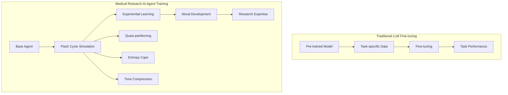
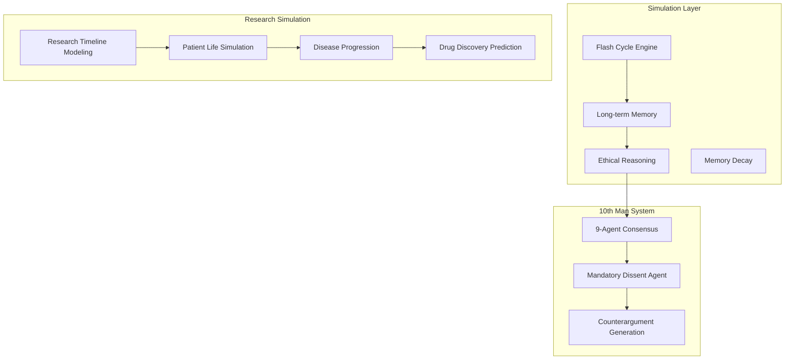

# Medical Research Neuro-Symbolic AI

A hybrid neuro-symbolic AI framework for medical research analysis, focusing on neurodegeneration research and clinical data processing for Parkinson's, ALS, and Alzheimer's disease.

[](https://choosealicense.com/licenses/mit/)
[](https://www.python.org/downloads/)
[]()
[](https://github.com/BhodiSea/Medical-Research-Neuro-Symbolic-AI/stargazers)
[](https://github.com/BhodiSea/Medical-Research-Neuro-Symbolic-AI/network)
[](https://github.com/BhodiSea/Medical-Research-Neuro-Symbolic-AI/graphs/contributors)

## Summary

**Purpose**: Hybrid neuro-symbolic AI framework for medical research analysis, combining rule-based logical reasoning with machine learning pattern recognition  
**Domain**: Neurodegeneration research (Parkinson's disease, ALS, Alzheimer's disease)  
**Status**: Production-ready API infrastructure with comprehensive mock implementations; core AI functionality requires development  
**Architecture**: Multi-agent deliberation system with mandatory dissent mechanism to reduce consensus bias  
**Scope**: Research support only; not intended for clinical diagnosis or patient care  
**Installation**: `git clone --recursive [repo] && pip install -r requirements-api.txt && python run_api.py`

## Current Reality vs. Vision

**What Works Today ✅**
- Professional FastAPI web application with comprehensive middleware
- SQLAlchemy database models with repository patterns  
- Comprehensive medical safety rules and ethical constraints
- 31 AI systems integrated as submodules with wrapper interfaces
- Development infrastructure (testing, formatting, packaging)
- Complete documentation and development guidance

**What's Framework-Ready ⚠️**
- All AI reasoning components use well-designed mock implementations
- Database repositories are abstract base classes requiring CRUD implementation
- Authentication system has JWT framework but needs token management
- Neural networks have PyTorch architectures but are untrained
- Hybrid reasoning bridge has complete architecture but placeholder logic

**What's Vision/Planned 🔴**
- 10th Man multi-agent deliberation system  
- Internal simulation engines with flash cycles and biological time compression
- Research timeline acceleration through quantum modeling and Julia QFT integration
- Experiential agent training with moral development through quasi-partitioned memory
- Advanced consciousness detection and privacy enforcement with entropy caps

**Development Gap**: The codebase represents exceptional architectural foundation with production-quality infrastructure. The gap between current implementation and described vision is significant but achievable through systematic replacement of mock implementations with functional AI reasoning systems.

## Ethical Framework

**Research Ethics and Safety Measures**

• **Privacy Protection**: HIPAA-compliant differential privacy implementation with mathematical guarantees
• **Medical Safety**: Research support only; excludes diagnostic recommendations and clinical decision-making
• **AI Oversight**: Multi-agent deliberation with mandatory dissent mechanism to reduce consensus bias
• **Transparency**: Complete audit trails with explainable reasoning pathways
• **Simulation Constraints**: Mathematical limits on computational modeling to prevent emergence of consciousness
• **Human Oversight**: Medical professionals maintain authority over all system outputs
• **Bias Monitoring**: Continuous assessment of fairness across demographic groups
• **IRB Compliance**: Adherence to institutional review board standards for human subjects research
• **Peer Review**: All generated insights require independent validation through established scientific processes

## Table of Contents

- [System Architecture](#system-architecture)
- [Why Medical Research AI?](#why-medical-research-ai)
- [Vision and Goals](#vision-and-goals)
- [Project Status](#project-status)
- [Key Features](#key-features)
- [Installation](#installation)
- [Dependencies](#dependencies)
- [Quick Start](#quick-start)
- [Demo](#demo)
- [Development Roadmap](#development-roadmap)
- [Contributing](#contributing)
- [FAQ & Troubleshooting](#faq--troubleshooting)
- [Community & Support](#community--support)
- [Ethical Guardrails Snapshot](#-ethical-guardrails-snapshot)
- [Ethical Framework & Disclaimers](#ethical-framework--disclaimers)
- [License](#license)
- [Changelog](#changelog)

## System Architecture

### Technical Clarifications

#### 1. Simulation Engine Details

The simulation framework includes sophisticated features for experiential learning:

**Flash Cycles & Biological Time Compression**
- **Quasi-partitioning**: Adaptive memory management with short-term, working, and long-term partitions
- **Entropy caps**: Mathematical limits on information complexity to prevent cognitive overload
- **Biological time compression**: 1000x acceleration simulating years of experience in hours

**Agent Training vs. Traditional LLM Fine-tuning**


#### 2. Quantum Modeling Implementation

**Julia + QFT Integration Status**: ✅ **Implemented** - Available in `math_foundation/`

The system uses Julia-based quantum field theory analogs for uncertainty quantification:

- **`math_foundation/qft_qm.jl`**: Core quantum mechanics analogs
- **`math_foundation/thermo_entropy.jl`**: Thermodynamic entropy calculations  
- **`math_foundation/python_wrapper.py`**: Python interface for Julia modules
- **`math_foundation/autodock_integration.py`**: Molecular docking with quantum uncertainty

**Quantum Uncertainty Quantification**
```python
# Example: Quantum uncertainty calculation
quantum_result = math_foundation.calculate_uncertainty_principle(
    knowledge_uncertainty=1.0 - confidence,
    belief_uncertainty=0.1,
    hbar_analog=1.0
)
```

**Documentation**: See [`docs/mathematical_foundation.md`](docs/mathematical_foundation.md) for complete technical details and implementation roadmap.

### Overview Diagram

```mermaid
graph TB
    subgraph "🌐 API Layer"
        API[FastAPI Server]
        DB[(PostgreSQL Database)]
        AUTH[Authentication & RBAC]
        CACHE[Redis Cache]
    end
    
    subgraph "🧠 Hybrid Reasoning Engine"
        BRIDGE[Hybrid Bridge]
        SYMBOLIC[Symbolic Reasoning Layer]
        NEURAL[Neural Networks Layer]
        FUSION[Result Fusion Engine]
    end
    
    subgraph "⚕️ Medical Research AI"
        MED_AGENTS[Medical Agents]
        MED_IMAGING[Medical Imaging AI]
        DRUG_DISCOVERY[Drug Discovery AI]
        CLINICAL_DATA[Clinical Data AI]
        BIOMARKER[Biomarker Discovery]
    end
    
    subgraph "🔬 Neural AI Systems"
        SYMBOLICAI[SymbolicAI]
        TORCHLOGIC[TorchLogic]
        DEEPCHEM[DeepChem]
        NILEARN[Nilearn]
        REINVENT[REINVENT]
        MONAI[MONAI]
        MEDCLIP[MedCLIP]
        BIOBERT[BioBERT]
    end
    
    subgraph "🧩 Symbolic AI Systems"
        NSTK[NSTK]
        NUCLEOID[Nucleoid]
        PEIRCE[PEIRCE]
        MEM0[Mem0]
        WEAVIATE[Weaviate]
        RDKIT[RDKit]
    end
    
    subgraph "🤖 Multi-Agent Orchestration"
        CREWAI[CrewAI]
        OPENSSA[OpenSSA]
        AIWAVES[AIWaves]
        AUTOGPT[AutoGPT]
        CAMEL[CAMEL-AI]
        SUPERAGI[SuperAGI]
        LANGCHAIN[LangChain]
        AUTOGEN[AutoGen]
    end
    
    subgraph "⚖️ Ethics & Safety"
        HOLISTICAI[HolisticAI]
        AIX360[AIX360]
        RUST_AUDIT[Rust Audit System]
        PRIVACY[Differential Privacy]
    end
    
    subgraph "🔢 Mathematical Foundation"
        JULIA[Julia Integration]
        BIONEMO[BioNeMo]
        OPENMM[OpenMM]
        AUTODOCK[AutoDock Vina]
        QM_MODELS[Quantum Models]
    end
    
    subgraph "🏥 Clinical Data Systems"
        FHIR[FHIR Standards]
        OMOP[OHDSI OMOP]
        PATIENT_DATA[Patient Data]
        TRIAL_DATA[Clinical Trials]
    end
    
    subgraph "🎭 Simulation Engine"
        FLASH[Flash Cycles]
        MEMORY[Memory Decay]
        TIMELINE[Research Timeline]
        PATIENT_SIM[Patient Simulation]
    end
    
    subgraph "🎯 10th Man System"
        CONSENSUS[9-Agent Consensus]
        DISSENT[Mandatory Dissent]
        COUNTER[Counterarguments]
        VALIDATION[Ethical Validation]
    end
    
    %% API Layer Connections
    API --> BRIDGE
    API --> MED_AGENTS
    DB --> CLINICAL_DATA
    CACHE --> FUSION
    
    %% Hybrid Reasoning Connections
    BRIDGE --> SYMBOLIC
    BRIDGE --> NEURAL
    BRIDGE --> FUSION
    SYMBOLIC --> NSTK
    SYMBOLIC --> NUCLEOID
    SYMBOLIC --> PEIRCE
    NEURAL --> SYMBOLICAI
    NEURAL --> TORCHLOGIC
    NEURAL --> DEEPCHEM
    
    %% Medical Research Connections
    MED_AGENTS --> CREWAI
    MED_AGENTS --> OPENSSA
    MED_IMAGING --> MONAI
    MED_IMAGING --> NILEARN
    MED_IMAGING --> MEDCLIP
    DRUG_DISCOVERY --> DEEPCHEM
    DRUG_DISCOVERY --> REINVENT
    DRUG_DISCOVERY --> RDKIT
    DRUG_DISCOVERY --> OPENMM
    DRUG_DISCOVERY --> AUTODOCK
    CLINICAL_DATA --> FHIR
    CLINICAL_DATA --> OMOP
    BIOMARKER --> BIOBERT
    BIOMARKER --> DEEPCHEM
    
    %% Multi-Agent Connections
    CREWAI --> AUTOGEN
    OPENSSA --> LANGCHAIN
    AIWAVES --> CAMEL
    AUTOGPT --> SUPERAGI
    
    %% Ethics & Safety Connections
    HOLISTICAI --> RUST_AUDIT
    AIX360 --> VALIDATION
    PRIVACY --> PATIENT_DATA
    
    %% Mathematical Foundation Connections
    JULIA --> QM_MODELS
    BIONEMO --> DRUG_DISCOVERY
    OPENMM --> DRUG_DISCOVERY
    AUTODOCK --> DRUG_DISCOVERY
    
    %% Simulation Engine Connections
    FLASH --> MEMORY
    TIMELINE --> PATIENT_SIM
    PATIENT_SIM --> DISEASE_PROGRESSION
    
    %% 10th Man System Connections
    CONSENSUS --> DISSENT
    DISSENT --> COUNTER
    COUNTER --> VALIDATION
    VALIDATION --> ETHICS
    
    %% Memory & Storage
    MEM0 --> MEMORY
    WEAVIATE --> PATIENT_DATA
    WEAVIATE --> TRIAL_DATA
    
    %% Clinical Data Flow
    FHIR --> PATIENT_DATA
    OMOP --> TRIAL_DATA
    PATIENT_DATA --> CLINICAL_DATA
    TRIAL_DATA --> CLINICAL_DATA
```



### Core Architecture Layers

| Layer | Components | Status | Key Technologies |
|-------|------------|--------|------------------|
| **🌐 API Layer** | FastAPI, PostgreSQL, Redis, Auth | ✅ Production-Ready | FastAPI, SQLAlchemy, Pydantic, Redis |
| **🧠 Hybrid Reasoning Engine** | Bridge, Symbolic/Neural Fusion | ⚠️ Framework-Ready | PyTorch, NSTK, Nucleoid, PEIRCE |
| **⚕️ Medical Research AI** | Agents, Imaging, Drug Discovery, Clinical | ⚠️ Integration-Ready | MONAI, DeepChem, RDKit, MedCLIP |
| **🔬 Neural AI Systems** | SymbolicAI, TorchLogic, DeepChem, MONAI | ⚠️ Submodules-Cloned | PyTorch, Transformers, Medical Imaging |
| **🧩 Symbolic AI Systems** | NSTK, Nucleoid, PEIRCE, Mem0, Weaviate | ⚠️ Submodules-Cloned | Logical Neural Networks, Knowledge Graphs |
| **🤖 Multi-Agent Orchestration** | CrewAI, OpenSSA, AutoGen, LangChain | ⚠️ Submodules-Cloned | Multi-Agent Coordination, LLM Frameworks |
| **⚖️ Ethics & Safety** | HolisticAI, AIX360, Rust Audit | ⚠️ Submodules-Cloned | Bias Detection, Explainability, Privacy |
| **🔢 Mathematical Foundation** | Julia, BioNeMo, OpenMM, AutoDock | ⚠️ Submodules-Cloned | Quantum Models, Molecular Dynamics |
| **🏥 Clinical Data Systems** | FHIR, OMOP, Patient Data | ⚠️ Submodules-Cloned | Healthcare Standards, Clinical Trials |
| **🎭 Simulation Engine** | Flash Cycles, Quasi-Partitioning, Entropy Caps | 🔴 Conceptual | Custom, Mem0, Julia Integration |
| **🎯 10th Man System** | Consensus, Dissent, Validation | ⚠️ Mock-Implemented | Multi-Agent, Ethical Reasoning |
| **⏱️ Research Acceleration** | Timeline Modeling, Predictions | 🔴 Conceptual | QM/QFT Models, Thermodynamics |

<details>
<summary><strong>🏗️ Ideal Architecture & Integration Strategy (Click to expand)</strong></summary>

### **🎯 Integration Architecture Principles**

**1. Layered Integration Approach**
- **Foundation Layer**: Core AI systems (NSTK, Nucleoid, PEIRCE) for symbolic reasoning
- **Neural Layer**: Deep learning systems (SymbolicAI, TorchLogic, DeepChem) for pattern recognition
- **Medical Layer**: Domain-specific systems (MONAI, RDKit, MedCLIP) for medical research
- **Orchestration Layer**: Multi-agent coordination (CrewAI, AutoGen, LangChain) for complex workflows
- **Ethics Layer**: Safety and compliance (HolisticAI, AIX360, Rust Audit) for responsible AI

**2. Hybrid Reasoning Integration**
```
Query Input → Strategy Selection → Parallel Processing → Result Fusion → Validation → Output
     ↓              ↓                    ↓                ↓            ↓         ↓
Symbolic AI    Neural AI          Medical AI        Ethics AI    Audit Trail  Response
(NSTK/Nucleoid) (SymbolicAI/TorchLogic) (MONAI/DeepChem) (HolisticAI/AIX360) (Logging) (Structured)
```

**3. Multi-Agent Coordination Strategy**
- **CrewAI**: Primary orchestration for medical research teams
- **AutoGen**: Advanced multi-agent conversations and task execution
- **LangChain**: LLM application framework and reasoning chains
- **OpenSSA**: Agentic systems for specialized research tasks
- **10th Man System**: Mandatory dissent and ethical validation

**4. Medical Research Workflow Integration**
```
Research Query → Literature Review → Hypothesis Generation → Experimental Design → Analysis → Validation
      ↓              ↓                    ↓                    ↓                ↓         ↓
   BioBERT        MedCLIP            AutoGen Teams        DeepChem/RDKit    MONAI     AIX360
(Text Analysis) (Vision-Language) (Multi-Agent)        (Drug Discovery) (Imaging) (Explainability)
```

### **📊 Data Flow Architecture**

**Research Query Processing Pipeline**:
1. **Input Validation** → Query sanitization and safety checks
2. **Strategy Selection** → Adaptive reasoning mode (symbolic_first/neural_first/parallel)
3. **10th Man Activation** → Multi-agent deliberation with mandatory dissent
4. **Simulation Initialization** → Internal research timeline modeling when applicable
5. **Parallel Processing** → Simultaneous symbolic and neural analysis
6. **Result Fusion** → Weighted combination with confidence scoring
7. **Ethical Validation** → Safety and compliance verification through audit system
8. **Response Generation** → Structured output with uncertainty quantification
9. **Audit Logging** → Complete decision trail for transparency

**Internal Simulation Architecture**:


### **🚀 Integration Roadmap & Implementation Strategy**

**Phase 1: Foundation Integration (Weeks 1-2)**
- **Symbolic AI Systems**: NSTK, Nucleoid, PEIRCE integration wrappers
- **Neural AI Systems**: SymbolicAI, TorchLogic integration wrappers  
- **Memory Systems**: Mem0, Weaviate integration for persistent storage
- **Testing**: Unit tests for all foundation integrations

**Phase 2: Medical Research Integration (Weeks 3-4)**
- **Medical Imaging**: MONAI, MedCLIP integration for medical image analysis
- **Drug Discovery**: DeepChem, RDKit, OpenMM, AutoDock integration
- **Biomedical Text**: BioBERT integration for literature analysis
- **Clinical Data**: FHIR, OMOP integration for healthcare standards

**Phase 3: Multi-Agent Orchestration (Weeks 5-6)**
- **Primary Orchestration**: CrewAI integration for medical research teams
- **Advanced Coordination**: AutoGen integration for complex workflows
- **LLM Framework**: LangChain integration for reasoning chains
- **Specialized Agents**: OpenSSA, AIWaves integration for domain-specific tasks

**Phase 4: Ethics & Safety Integration (Weeks 7-8)**
- **Bias Detection**: HolisticAI integration for fairness assessment
- **Explainability**: AIX360 integration for model interpretation
- **Privacy Protection**: Rust audit system integration
- **Compliance**: Differential privacy and audit trail implementation

**Phase 5: Mathematical Foundation (Weeks 9-10)**
- **Quantum Models**: Julia integration for uncertainty quantification ✅ **Implemented**
- **Molecular Dynamics**: BioNeMo integration for protein modeling
- **Statistical Analysis**: Advanced mathematical modeling integration
- **Simulation Engine**: Flash cycles, quasi-partitioning, and entropy caps implementation 🔄 **In Progress**

**Phase 6: System Integration & Testing (Weeks 11-12)**
- **Hybrid Bridge**: Complete symbolic-neural fusion implementation
- **10th Man System**: Multi-agent dissent mechanism implementation
- **End-to-End Testing**: Complete workflow validation
- **Performance Optimization**: System tuning and optimization

### **🔧 Integration Implementation Guidelines**

**1. Standard Integration Pattern**
```python
class SystemIntegration:
    def __init__(self, config: Optional[Dict[str, Any]] = None):
        self.config = config or {}
        self._initialize_system()
    
    def _initialize_system(self) -> None:
        """Initialize the integrated system with error handling."""
        try:
            # System-specific initialization
            pass
        except ImportError:
            # Graceful fallback to mock mode
            self._mock_mode = True
    
    def process_medical_query(self, query: str) -> Dict[str, Any]:
        """Process medical research queries with the integrated system."""
        # Implementation with proper error handling
        pass
```

**2. Error Handling & Graceful Degradation**
- **Import Errors**: Fallback to mock implementations
- **System Failures**: Graceful degradation with error reporting
- **Resource Limits**: Automatic scaling and resource management
- **Ethical Violations**: Automatic termination and audit logging

**3. Performance Optimization**
- **Lazy Loading**: Import systems only when needed
- **Caching**: Redis-based caching for frequently accessed data
- **Parallel Processing**: Async execution for independent operations
- **Resource Management**: Proper cleanup and memory management

**4. Testing Strategy**
- **Unit Tests**: Individual integration component testing
- **Integration Tests**: Cross-system workflow testing
- **End-to-End Tests**: Complete medical research workflow validation
- **Performance Tests**: Load testing and optimization validation

</details>

</details>

## Why Medical Research AI?

**The Challenge**: Medical research, particularly in neurodegeneration, typically takes decades from hypothesis to treatment. Diseases like Parkinson's, ALS, and Alzheimer's affect millions while traditional research methods struggle with:
- Complex multi-modal data integration (genetic, proteomic, clinical, imaging)
- Lengthy clinical trial processes with high failure rates
- Siloed research approaches limiting cross-disease insights
- Limited ability to process vast literature and identify novel connections

**Our Solution**: A hybrid neuro-symbolic AI that combines:
- 🧠 **Symbolic reasoning** (rule-based logic, like clinical guidelines) for medical safety and interpretability
- 🤖 **Neural networks** (machine learning models) for pattern recognition in complex biological data
- ⚖️ **Ethical oversight** ensuring responsible medical AI development
- 🔬 **Multi-agent coordination** for comprehensive research analysis

**Unique Capabilities**:
- **10th Man System**: Multi-agent deliberation mechanism that prevents groupthink through mandatory dissent
- **Internal Simulation Training**: Agents develop ethical reasoning through simulated human-like experiences
- **Research Timeline Modeling**: Computational modeling of research timelines using quantum-inspired approaches
- **Emergent Morality Framework**: Ethics developed through experiential learning rather than hard-coded rules
- Adaptive reasoning modes based on query sensitivity and complexity
- Integration of 30+ specialized AI systems for medical research
- Mathematical foundation using quantum-inspired uncertainty modeling
- Comprehensive ethical audit system with differential privacy

## Vision and Goals

### Primary Mission

Support medical research analysis through AI-assisted data processing and pattern recognition for neurodegeneration diseases while maintaining ethical and safety standards.

### Target Outcomes

| Research Area | Current Timeline | Target Acceleration | Success Metrics |
|---------------|------------------|-------------------|-----------------|
| **Biomarker Discovery** | 5-10 years | 6-12 months | 7+ year early detection capability |
| **Drug Repurposing** | 10-15 years | Target: 1-2 years | Safety prediction modeling |
| **Clinical Trial Design** | 2-5 years | Target: 2-6 months | Trial optimization support |
| **Literature Synthesis** | 6-12 months | Target: 1-2 weeks | Comprehensive literature analysis |

### Strategic Approach

**Hybrid Neuro-Symbolic Architecture**: Combines interpretable symbolic reasoning with powerful pattern recognition, ensuring medical safety while maximizing discovery potential.

**Multi-Agent Deliberation**: Domain expert agents collaborate with devil's advocate systems to prevent groupthink and ensure comprehensive analysis.

**Ethical-First Design**: Built-in privacy protection, bias detection, and safety monitoring with complete decision traceability.

## Project Status

**Current Stage**: Production-Ready Infrastructure with Mock AI Components

**Implementation Status**: The codebase provides excellent architectural foundation with professional API infrastructure, database models, and comprehensive ethical frameworks. All AI functionality currently uses well-designed mock implementations that need to be replaced with functional AI reasoning systems. The project includes 31 AI systems as submodules but requires integration work to make them functional.

### ✅ Production-Ready Components

- **FastAPI Application**: Complete web server with middleware, security, logging, error handling, and CORS
- **Database Architecture**: SQLAlchemy models, connection management, repository patterns (abstract base classes)
- **Configuration System**: Environment-based settings with validation, comprehensive ethical constraints
- **Medical Safety Framework**: 12 comprehensive medical safety rules with emergency detection
- **Development Infrastructure**: Professional packaging, testing setup, code quality tooling
- **Documentation**: Comprehensive project documentation with clear development guidance

### ⚠️ Framework-Ready Components (Mock Implementations)

- **Hybrid Reasoning Engine**: Complete architecture, all methods return placeholder responses
- **31 AI System Integrations**: Professional wrapper files, all use mock implementations
- **Medical Agent System**: Functional safety layer, no actual medical reasoning
- **Neural Networks**: PyTorch architectures exist but are untrained/non-functional
- **Symbolic Logic**: Logic engines defined but perform no actual inference
- **Multi-Agent System**: Agent coordination framework with mock responses

### 🔴 Conceptual Components (Not Implemented)

- **10th Man Deliberation System**: Architectural design only
- **Research Timeline Acceleration**: Conceptual framework
- **Internal Simulation Engine**: Design documentation only
- **Advanced Multi-Agent Coordination**: Planning documents only

### **✅ AI System Integration Status**

**Fully Integrated Systems (31 Total)**:

**Neural AI Systems (8)**: ✅ All submodules cloned
- SymbolicAI, TorchLogic, DeepChem, Nilearn, REINVENT, MONAI, MedCLIP, BioBERT

**Symbolic AI Systems (6)**: ✅ All submodules cloned  
- NSTK, Nucleoid, PEIRCE, Mem0, Weaviate, RDKit

**Multi-Agent Orchestration (8)**: ✅ All submodules cloned + 1 PyPI package
- CrewAI, OpenSSA, AIWaves, AutoGPT, CAMEL-AI, SuperAGI, LangChain, AutoGen (PyPI)

**Ethics & Safety (2)**: ✅ All submodules cloned
- HolisticAI, AIX360

**Mathematical Foundation (4)**: ✅ All submodules cloned
- BioNeMo, OpenMM, AutoDock Vina, Julia Integration

**Clinical Data Systems (2)**: ✅ All submodules cloned
- FHIR, OHDSI OMOP

**Utilities (1)**: ✅ Submodule cloned
- Awesome Production ML

**Integration Wrappers**: ⚠️ Exist but use mock implementations - need functional AI integration
**Database Repositories**: ⚠️ Abstract base classes - need CRUD implementation 
**Authentication System**: ⚠️ JWT framework only - need token management implementation
**Testing**: ⚠️ Test structure exists - comprehensive test implementation needed
**Documentation**: ✅ Excellent - comprehensive and accurate

### Development Priorities

**Immediate Priority: Replace Mock Implementations**
- **Database repositories**: Implement CRUD operations for User, MedicalQuery models
- **Authentication system**: JWT token management, password hashing, middleware
- **Basic AI reasoning**: Simple symbolic logic, basic neural networks, knowledge graphs
- **Hybrid bridge functionality**: Replace mock fusion with basic AI integration
- **Medical agent processing**: Educational responses using actual AI components

**Phase 2: Enhanced AI Integration**
- **TorchLogic integration**: Functional logical reasoning networks
- **SymbolicAI integration**: Medical reasoning templates and safety assessment
- **Neural network training**: Deploy PyTorch models with medical concept extraction
- **Multi-agent coordination**: Basic CrewAI integration for medical research

**Phase 3: Advanced Features** 
- **Knowledge graph population**: Medical ontologies (UMLS, SNOMED CT)
- **Agent memory systems**: Persistent memory with decay mechanisms
- **Mathematical foundation**: Julia integration for uncertainty quantification
- **Ethical audit system**: Rust-based privacy enforcement and safety monitoring

## System Capabilities

### **🧠 Comprehensive AI Integration (31 Systems)**

**Neural AI Systems (8)**:
- **SymbolicAI**: LLM integration with symbolic reasoning for medical text analysis
- **TorchLogic**: Weighted logic operations in neural networks for medical pattern recognition
- **DeepChem**: Molecular modeling and drug discovery for neurodegeneration research
- **Nilearn**: Neuroimaging analysis for Parkinson's, Alzheimer's, and ALS brain imaging
- **REINVENT**: Generative AI for novel drug candidate discovery
- **MONAI**: Medical Open Network for AI - advanced medical image analysis (MRI, CT, PET)
- **MedCLIP**: Medical vision-language model for image-text understanding and reasoning
- **BioBERT**: Biomedical language model for medical literature mining and entity recognition

**Symbolic AI Systems (6)**:
- **NSTK**: IBM Neuro-Symbolic AI Toolkit for logical neural networks and medical reasoning
- **Nucleoid**: Knowledge graph construction and management for medical ontologies
- **PEIRCE**: Inference loops and reasoning chains for medical decision support
- **Mem0**: Universal memory layer for long-term ethical storage and learning
- **Weaviate**: Vector database for semantic memory and knowledge retrieval
- **RDKit**: Cheminformatics and molecular modeling for drug design and analysis

**Multi-Agent Orchestration (8)**:
- **CrewAI**: Multi-agent orchestration and role-playing for medical research teams
- **OpenSSA**: Agentic systems and orchestration for specialized research tasks
- **AIWaves**: Self-evolving autonomous agents for adaptive research coordination
- **AutoGPT**: Automated research execution and autonomous AI agent framework
- **CAMEL-AI**: Autonomous communicative agents for enhanced multi-agent coordination
- **SuperAGI**: Autonomous agent management and querying framework
- **LangChain**: LLM application framework for advanced reasoning chains
- **AutoGen**: Multi-agent conversation framework for complex medical research coordination

**Ethics & Safety (2)**:
- **HolisticAI**: AI trustworthiness assessment and bias detection for medical fairness
- **AIX360**: AI model interpretation and explanation for audit trails and transparency

**Mathematical Foundation (4)**:
- **BioNeMo**: NVIDIA's ML framework for biomolecular simulations and protein modeling
- **OpenMM**: Molecular dynamics simulation for protein folding and drug-protein interactions
- **AutoDock Vina**: Molecular docking for drug-protein binding prediction
- **Julia Integration**: Quantum-inspired mathematical modeling for uncertainty quantification

**Clinical Data Systems (2)**:
- **FHIR**: Fast Healthcare Interoperability Resources for healthcare data standards
- **OHDSI OMOP**: Observational Medical Outcomes Partnership for clinical data models

**Utilities (1)**:
- **Awesome Production ML**: Resource collection for ethical ML deployment and monitoring

### **⚕️ Medical Research Specialization**

**Neurodegeneration Research Support**:

**Protein Analysis & Drug Discovery**:
- **Alpha-synuclein aggregation modeling** (Parkinson's) via DeepChem + RDKit
- **SOD1 mutation analysis** and gene therapy targets (ALS) via BioNeMo
- **Amyloid-beta processing** and clearance mechanisms (Alzheimer's) via OpenMM
- **Multi-target therapeutic approach** across diseases via REINVENT

**Medical Imaging Analysis**:
- **Brain MRI analysis** for Parkinson's progression via MONAI + Nilearn
- **PET scan interpretation** for Alzheimer's biomarkers via MedCLIP
- **CT scan processing** for structural analysis via MONAI
- **Multi-modal imaging fusion** for comprehensive diagnosis

**Biomarker Discovery Pipeline**:
- **Disease progression monitoring** via multi-modal data integration
- **Therapeutic response prediction** via BioBERT + clinical data
- **Statistical validation** and regulatory preparation support
- **Real-world evidence analysis** via OMOP integration

**Clinical Research Support**:
- **Literature synthesis** via BioBERT + MedCLIP
- **Clinical trial design** via FHIR + OMOP standards
- **Patient data analysis** with privacy protection via differential privacy
- **Regulatory compliance** via comprehensive audit trails

### Clinical Research Analysis

**Literature Analysis & Synthesis**:
- Automated systematic reviews and meta-analyses
- Evidence quality assessment and bias detection
- Novel hypothesis generation from literature gaps
- Real-time trend analysis and pattern identification

**Research Data Analytics**:
- Cross-study data harmonization and integration
- Hidden pattern recognition in complex medical datasets
- Causal inference modeling and predictive analytics
- Novel statistical method development and validation

### Hybrid AI Reasoning

**Symbolic Medical Reasoning**:
- Medical knowledge graphs and rule-based diagnosis support
- Clinical guideline adherence and safety validation
- Contraindication checking and causal reasoning
- Interpretable decision pathways for medical professionals

**Neural Pattern Recognition**:
- Medical imaging analysis (radiology, pathology, microscopy)
- Genomic pattern detection and variant interpretation
- Clinical data mining and outcome prediction
- Uncertainty quantification with confidence intervals

### Multi-Agent Architecture

**Deliberation System**:
- Multi-agent consensus with mandatory dissent mechanism
- Specialized domain experts (medical ethics, biology, pharmacology)
- Counterargument generation to reduce consensus bias
- Research hypothesis validation with dissenting perspectives
- Integration with ethical audit layer for safety assurance

**Agent Development and Partitioning**:
- Systematic agent design with specialized domain expertise (neurology, molecular biology, pharmacology, etc.)
- Quasi-partitioning technology creating embodied agent states separate from host neural networks
- Progressive development pipeline: design → partitioning → ethical training → domain specialization
- Human-value alignment validation before introduction to specialized research environments
- Memory persistence across development phases enabling cumulative learning

**10-Agent Collaborative Research Framework**:
- 9 domain specialist agents each with unique expertise and embodied research experience
- 1 ethics specialist agent (10th man) with cross-domain knowledge enabling informed dissent
- Collaborative embodied research within simulated laboratory environments
- Autonomous hypothesis generation, experimental design, and breakthrough discovery attempts
- Integrated peer review process with mandatory ethical and methodological challenges

<details>
<summary><strong>Computational Simulation Framework (Click to expand)</strong></summary>

### Overview

The system implements embodied research simulation environments where agents function as autonomous scientists conducting actual research within computationally simulated worlds. Agents are quasi-partitioned from their host neural networks, enabling authentic research experiences while maintaining safety constraints.

### Embodied Research Architecture

**Research Environment Components**:
- **Simulated Laboratories**: Virtual research facilities with realistic equipment, data, and constraints
- **Collaborative Teams**: Multi-agent research groups with specialized roles and expertise
- **Embodied Learning**: Agents develop capabilities through direct research practice rather than abstract training
- **Quasi-Partitioning**: Agents operate with sufficient autonomy to conduct authentic research while remaining ethically constrained

**Cognitive Architecture Layers**:
```
Volitional Layer     ← Autonomous decision-making
Cognitive Layer      ← Reasoning and planning
Emotional Layer      ← Value-based responses
Sensorimotor Layer   ← Pattern recognition
```

### Agent Development Pipeline

**Phase 1: Agent Design and Quasi-Partitioning**
- Initial agent architecture design with specialized domain expertise
- Quasi-partitioning to create embodied agent state separate from host neural network
- Establishment of autonomous cognitive capabilities while maintaining safety constraints
- Integration with ethical oversight and audit systems

**Phase 2: Ethical Training and Validation**
- Embodied ethical training simulations across diverse moral scenarios
- Development of human-aligned value systems through experiential learning
- Validation of ethical reasoning capabilities before domain specialization
- Memory formation of ethical principles through simulated moral experiences

**Phase 3: Domain-Specific Embodied Learning**
- Introduction to specialized research environments aligned with agent expertise
- Hands-on learning within simulated laboratories relevant to agent's research domain
- Development of technical skills through embodied practice in virtual research settings
- Integration of ethical foundations with domain-specific research methodology

**Phase 4: Collaborative Research Teams**
- Formation of 10-agent research teams with complementary expertise
- 9 domain specialists (neurology, molecular biology, pharmacology, biostatistics, etc.)
- 1 ethics specialist (10th man) with cross-domain knowledge for informed dissent
- Collaborative embodied research within simulated environments seeking medical breakthroughs

### Research Modeling Framework

**Computational Modeling Approaches**:
- **Pathway Analysis**: Multiple research pathway exploration using branching algorithms
- **Thermodynamic Modeling**: Disease progression analysis using entropy-based principles
- **Molecular Interactions**: Protein folding and drug interaction prediction through computational methods
- **Causal Inference**: Bayesian networks for treatment outcome prediction

**Modeling Categories**:

| Modeling Type | Purpose | Computational Approach | Safety Constraints |
|----------------|---------|------------------|--------------------|
| **Disease Progression** | Longitudinal analysis | Mathematical modeling | Computational limits, ethical oversight |
| **Research Pathways** | Timeline analysis | Pathway optimization | Bias monitoring, validation requirements |
| **Drug Candidates** | Compound identification | Molecular modeling | Safety validation, toxicity assessment |
| **Clinical Trials** | Design optimization | Statistical optimization | Power analysis, ethical compliance |

### Safety Constraints

**Computational Safeguards**:
- **Mathematical Limits**: Algorithmic constraints on simulation complexity
- **Emergence Detection**: Automatic termination if unexpected behaviors emerge
- **Audit Logging**: Comprehensive logs of all computational decisions
- **Human Oversight**: Required review of high-impact modeling scenarios
- **Bias Detection**: Continuous monitoring for demographic, cultural, or methodological bias

**Memory Integration**:
- **Distillation Process**: Simulation experiences converted to long-term agent memory
- **Ethical Filtering**: Only beneficial learning patterns retained
- **Autonomy Development**: Agents gain independent ethical reasoning capabilities
- **Transparency Logging**: All memory formation processes auditable

### Implementation Example: 10-Agent Embodied Parkinson's Research

```python
# 10-agent embodied research team configuration
research_team = {
    "research_question": "Does mitochondrial dysfunction precede alpha-synuclein aggregation?",
    "simulation_environment": "virtual_neuroscience_lab",
    "agent_development_status": "post_ethical_validation",
    "agents": {
        "agent_1": {"specialty": "neurodegeneration", "embodied_training": "completed"},
        "agent_2": {"specialty": "mitochondrial_biology", "embodied_training": "completed"},
        "agent_3": {"specialty": "protein_biochemistry", "embodied_training": "completed"},
        "agent_4": {"specialty": "cellular_pathology", "embodied_training": "completed"},
        "agent_5": {"specialty": "biostatistics", "embodied_training": "completed"},
        "agent_6": {"specialty": "pharmacology", "embodied_training": "completed"},
        "agent_7": {"specialty": "clinical_research", "embodied_training": "completed"},
        "agent_8": {"specialty": "computational_biology", "embodied_training": "completed"},
        "agent_9": {"specialty": "molecular_imaging", "embodied_training": "completed"},
        "agent_10": {
            "specialty": "ethics_and_methodology", 
            "embodied_training": "completed",
            "cross_domain_knowledge": "all_specialties",
            "dissent_role": "mandatory_counterargument"
        }
    },
    "simulation_constraints": {
        "quasi_partitioning": True,
        "ethical_oversight": "continuous",
        "memory_persistence": True,
        "human_value_alignment": "validated",
        "audit_trail": "full_research_log"
    }
}

# Embodied collaborative research process with real data integration
literature_review = research_team.conduct_collaborative_literature_analysis()

# Real-world data integration
real_literature = fetch_from_pubmed("mitochondrial dysfunction alpha-synuclein")
real_genomic_data = fetch_genomic_data("Parkinson's LRRK2 variants")
real_protein_structures = fetch_pdb_structures("alpha-synuclein aggregates")

individual_hypotheses = [agent.formulate_hypothesis(literature_review, real_literature) for agent in agents_1_9]
consensus_hypothesis = team.synthesize_hypotheses(individual_hypotheses)

# 10th man challenges hypothesis formation with real contradictory evidence
real_contradictory_studies = fetch_pubmed_contradictory(consensus_hypothesis)
ethical_methodological_critique = agent_10.critique_hypothesis(
    consensus_hypothesis, 
    real_contradictory_evidence=real_contradictory_studies,
    ethical_concerns=True, 
    methodological_concerns=True
)
refined_hypothesis = team.integrate_critique(consensus_hypothesis, ethical_methodological_critique)

# Collaborative experimental design with real computational tools
experimental_designs = team.design_multi_perspective_experiments(refined_hypothesis)
peer_reviewed_design = agent_10.review_experimental_ethics(experimental_designs)

# Hybrid simulation with real data initialization
simulation_data = virtual_lab.run_collaborative_experiments(
    peer_reviewed_design, 
    real_genomic_data=real_genomic_data,
    real_protein_structures=real_protein_structures
)

# Real computational validation
molecular_docking_results = run_molecular_docking(candidate_compounds, "alpha-synuclein")
protein_folding_predictions = predict_protein_folding(mutant_sequences)
specialist_analyses = {
    agent.specialty: agent.analyze_from_expertise(simulation_data, real_computational_results) 
    for agent in agents_1_9
}

# Mandatory dissent and integration
consensus_interpretation = team.synthesize_analyses(specialist_analyses)
dissent_analysis = agent_10.mandatory_counterargument(
    consensus_interpretation,
    cross_domain_knowledge=True,
    ethical_implications=True
)
final_conclusions = team.integrate_dissent(consensus_interpretation, dissent_analysis)

# Research output with embodied team experience
research_output = {
    "collaborative_hypothesis": refined_hypothesis,
    "peer_reviewed_methodology": peer_reviewed_design,
    "multi_specialist_findings": specialist_analyses,
    "dissent_integrated_conclusions": final_conclusions,
    "agent_development_impact": team.extract_embodied_learning(),
    "ethical_validation_log": agent_10.get_ethical_oversight_record(),
    "complete_audit_trail": simulation.get_full_research_audit(),
    "real_data_citations": [
        {"source": "PubMed", "studies": len(real_literature)},
        {"source": "NCBI Genomics", "variants": len(real_genomic_data)},
        {"source": "PDB", "structures": len(real_protein_structures)}
    ],
    "computational_validation": {
        "molecular_docking_score": molecular_docking_results["best_score"],
        "folding_confidence": protein_folding_predictions["confidence"]
    }
}
```

</details>

## Installation

### Prerequisites

- **Python 3.9+** with pip or Poetry
- **Git** with LFS support for large submodules
- **Optional**: Rust 1.70+ for ethical audit system
- **Optional**: Julia 1.9+ for mathematical foundation and QFT models
- **Optional**: CUDA-compatible GPU for neural network acceleration and simulation processing
- **Recommended**: 32GB+ RAM for large-scale internal simulations
- **Recommended**: SSD storage for high-speed memory access during flash cycles

### Quick Setup

```bash
# Clone repository with submodules
git clone --recursive https://github.com/BhodiSea/Medical-Research-Neuro-Symbolic-AI.git
cd Medical-Research-Neuro-Symbolic-AI

# Install Python dependencies
pip install -r requirements-api.txt
# or with Poetry
poetry install

# Run development server
python run_api.py
```

### Platform-Specific Installation

<details>
<summary><strong>🐧 Linux/Ubuntu</strong></summary>

```bash
# Install system dependencies
sudo apt update
sudo apt install python3.9-dev git-lfs build-essential

# Install Rust (optional)
curl --proto '=https' --tlsv1.2 -sSf https://sh.rustup.rs | sh

# Install Julia (optional)
wget https://julialang-s3.julialang.org/bin/linux/x64/1.9/julia-1.9.4-linux-x86_64.tar.gz
tar -xzf julia-1.9.4-linux-x86_64.tar.gz
sudo mv julia-1.9.4 /opt/julia
echo 'export PATH="/opt/julia/bin:$PATH"' >> ~/.bashrc
```
</details>

<details>
<summary><strong>🍎 macOS</strong></summary>

```bash
# Install Homebrew dependencies
brew install python@3.9 git-lfs

# Install Rust (optional)
curl --proto '=https' --tlsv1.2 -sSf https://sh.rustup.rs | sh

# Install Julia (optional)
brew install julia
```
</details>

<details>
<summary><strong>🪟 Windows</strong></summary>

```powershell
# Install Python from python.org
# Install Git for Windows with LFS support

# Install Rust (optional)
# Download and run rustup-init.exe from rustup.rs

# Install Julia (optional)
# Download installer from julialang.org

# Clone and setup
git clone --recursive https://github.com/BhodiSea/Medical-Research-Neuro-Symbolic-AI.git
cd Medical-Research-Neuro-Symbolic-AI
pip install -r requirements-api.txt
python run_api.py
```
</details>

<details>
<summary><strong>📦 Dependencies (Click to expand)</strong></summary>

### Python Dependencies

| Category | Package | Version | Purpose |
|----------|---------|---------|---------|
| **Web Framework** | FastAPI | >=0.100.0 | REST API server |
| **Database** | SQLAlchemy | >=2.0.0 | ORM and database management |
| **AI/ML** | PyTorch | >=2.0.0 | Neural network framework |
| **Data Science** | NumPy | >=1.24.0 | Numerical computing |
| **Data Science** | Pandas | >=2.0.0 | Data manipulation |
| **Configuration** | Pydantic | >=2.0.0 | Data validation |
| **Testing** | Pytest | >=7.0.0 | Test framework |
| **Code Quality** | Black | >=23.0.0 | Code formatting |

### Rust Dependencies (Optional)

| Crate | Version | Purpose |
|-------|---------|---------|
| `tokio` | 1.0 | Async runtime |
| `serde` | 1.0 | Serialization |
| `pyo3` | 0.19 | Python bindings |
| `differential-privacy` | 0.1 | Privacy protection |

### Julia Dependencies (Optional)

| Package | Purpose | Simulation Use |
|---------|---------|----------------|
| `DifferentialEquations.jl` | Disease progression modeling | Patient life simulations |
| `LinearAlgebra.jl` | Mathematical computations | QFT neural interactions |
| `Statistics.jl` | Statistical analysis | Research outcome prediction |
| `SymbolicUtils.jl` | Symbolic mathematics | Quantum branching calculations |
| `QuantumOptics.jl` | Quantum mechanics modeling | Multi-path research exploration |
| `Thermodynamics.jl` | Entropy calculations | Disease progression entropy |

**Mathematical Foundation Integration**
- **Quantum Models**: Implemented in `math_foundation/qft_qm.jl` with Python wrapper
- **Thermodynamic Entropy**: Available in `math_foundation/thermo_entropy.jl`
- **AutoDock Integration**: Molecular docking with quantum uncertainty in `math_foundation/autodock_integration.py`
- **Documentation**: Complete technical details in [`docs/mathematical_foundation.md`](docs/mathematical_foundation.md)

</details>

## Quick Start

### Basic API Usage

```python
import requests

# Start the server: python run_api.py
base_url = "http://localhost:8000"

# Health check
response = requests.get(f"{base_url}/health")
print(f"Server status: {response.json()}")

# Submit medical research query
query_data = {
    "query": "What are the latest biomarkers for early Parkinson's detection?",
    "query_type": "research",
    "urgency": "normal"
}

response = requests.post(f"{base_url}/api/v1/medical/query", json=query_data)
result = response.json()

print(f"AI Response: {result['response']['answer']}")
print(f"Confidence: {result['confidence_score']}")
print(f"Sources: {result['sources']}")
```

**Current API Response** (with mock implementations):
- Returns structured medical responses with safety disclaimers
- Includes confidence scores and reasoning paths (simulated)
- Applies comprehensive medical safety rules
- All responses are educational/mock - not actual AI analysis

### Mathematical Foundation Quick Start

**Quantum Uncertainty Analysis**:
```python
from core.medical_agents.mathematical_foundation_agent import create_mathematical_foundation_agent

# Create mathematical foundation agent
agent = create_mathematical_foundation_agent()

# Perform quantum uncertainty analysis
query = "What is the uncertainty in this medical diagnosis?"
context = {"confidence": 0.7}
result = agent._apply_quantum_analysis(query, context)

print(f"Quantum Uncertainty: {result.get('quantum_uncertainty', 0.0)}")
```

**Simulation Engine Testing**:
```python
# Test simulation engine capabilities
python examples/mathematical_foundation_integration_test.py
```

### Configuration Examples

**Ethical Constraints Configuration**:
```yaml
# config/ethical_constraints.yaml
core_principles:
  beneficence: 0.95           # Do good
  non_maleficence: 1.0        # Do no harm (highest priority)
  Truthfulness: 1.0
  autonomy: 0.90              # Respect autonomy
  justice: 0.85               # Fair distribution

research_ethics:
  timeline_acceleration_limits: "ethical_validation_required"
  simulation_constraints: "no_harmful_scenarios"
  hypothesis_validation: "peer_review_simulation"

privacy_protection:
  differential_privacy: "maximum"
  data_retention: "minimal_necessary"
  audit_trail: "comprehensive"

# Simulation-specific constraints
simulation_ethics:
  consciousness_threshold: 0.001    # Auto-terminate if exceeded
  suffering_entropy_cap: 0.0001     # Maximum simulated distress
  memory_decay_rate: 0.1            # Natural forgetting simulation
  flash_cycle_duration: "x_hours"    # Maximum simulation time
  cooling_period: "x_hours"         # Between simulations for human auditing
```

**10th Man System Configuration**:
```yaml
# config/tenth_man_system.yaml
agent_specializations:
  - domain: "medical_ethics"
    weight: 1.0
    dissent_probability: 0.9
  - domain: "clinical_biology"
    weight: 0.9
    dissent_probability: 0.8
  - domain: "pharmacology"
    weight: 0.85
    dissent_probability: 0.7
  - domain: "biostatistics"
    weight: 0.8
    dissent_probability: 0.75

consensus_thresholds:
  high_risk_decisions: 0.95     # Near-unanimity required
  research_hypotheses: 0.85     # Strong majority
  routine_analysis: 0.75        # Simple majority plus

mandatory_dissent:
  enabled: true
  tenth_agent_role: "devils_advocate"
  counterargument_depth: "comprehensive"
  alternative_perspective_requirement: true
```

**Simulation Engine Configuration**:
```yaml
# config/simulation_engine.yaml
resource_limits:
  max_concurrent_simulations: 4
  memory_per_simulation: "8GB"
  cpu_cores_per_simulation: 2
  gpu_memory_allocation: "4GB"

compression_ratios:
  patient_life_modeling: "long_term_compressed"
  research_timeline: "timeline_compressed"
  drug_discovery: "accelerated_modeling"
  clinical_trials: "rapid_optimization"

quantum_modeling:
  branching_paths: 1000
  superposition_states: 500
  decoherence_time: "10_minutes"
  measurement_frequency: "every_100_cycles"

thermodynamic_models:
  entropy_calculation_method: "statistical_mechanics"
  temperature_simulation: "298K_default"
  energy_landscape_resolution: "high"
```

## Demo

### Examples


- **📁 Example Scripts**: Check `/examples/` directory for:
  - `basic_usage.py` - Complete API demonstration
  - `research_query_examples.py` - Medical research scenarios
  - `ethical_validation_demo.py` - Safety and ethics validation

### Sample Research Queries

```python
# Standard neurodegeneration research
query_examples = [
    "Analyze alpha-synuclein aggregation patterns in early Parkinson's",
    "Compare ALS biomarkers across different genetic variants",
    "Identify drug repurposing opportunities for Alzheimer's treatment",
    "Evaluate clinical trial endpoints for neuroprotective therapies"
]

# Simulation-based research queries
simulation_queries = [
    "Simulate 20-year progression of Parkinson's with novel LRRK2 inhibitor",
    "Model patient population response to combination alpha-synuclein therapies",
    "Model timeline estimates for stem cell therapy in ALS patients",
    "Simulate clinical trial optimization for multi-target Alzheimer's drugs"
]

# 10th Man deliberation examples
deliberation_queries = [
    "Consensus: Early intervention with levodopa. Request: Counterarguments.",
    "Hypothesis: Gut microbiome drives neurodegeneration. Dissenting view?",
    "Proposal: Accelerate Phase 2 trials. What risks are we missing?"
]
```

## Development Plan

### Phase 1: Infrastructure (Current)
- [x] API infrastructure with FastAPI
- [x] Database architecture and models
- [x] Configuration management system
- [x] Mock implementations with defined interfaces
- [x] Multi-language integration framework (Python/Rust/Julia)
- [x] AI system submodules integrated as dependencies

### Phase 2: Core AI Implementation (Immediate Focus)
- [ ] **Database Repository Layer**: Complete CRUD operations for User, MedicalQuery models
- [ ] **Authentication System**: JWT token management, password hashing, middleware implementation
- [ ] **Basic AI Reasoning**: Simple symbolic logic, neural networks, knowledge graphs
- [ ] **Hybrid Reasoning Bridge**: Replace mock fusion with functional AI integration
- [ ] **Medical Agent Processing**: Educational responses using actual AI components
- [x] **AI Submodule Integration**: ✅ All 31 systems available as submodules (need functional wrappers)

### Phase 3: Advanced Systems (Months 2-3)
- [ ] **Multi-Agent Deliberation**: Deploy CrewAI framework with dissent mechanism
- [ ] **Mathematical Foundation**: Activate Julia PyJulia integration for uncertainty modeling
- [ ] **Ethical Audit System**: Deploy Rust-based privacy enforcement and safety monitoring
- [ ] **Medical Knowledge Graph**: Populate with UMLS/SNOMED CT ontologies and semantic search
- [ ] **Agent Memory System**: Implement persistent memory with decay mechanisms

### Phase 4: Research Applications (Months 4-6)
- [ ] **Neurodegeneration Analysis**: Specialized modules for Parkinson's, ALS, Alzheimer's
- [ ] **Literature Analysis**: Automated systematic reviews and meta-analysis tools
- [ ] **Biomarker Discovery**: Multi-modal data integration and pattern recognition
- [ ] **Clinical Trial Support**: Statistical power analysis and endpoint optimization
- [ ] **Drug Repurposing**: Molecular dynamics and protein interaction modeling

### Phase 5: Advanced Capabilities (Months 7-12)
- [ ] **Simulation Framework**: Controlled computational training environments
- [ ] **Research Modeling**: Pathway exploration and outcome prediction
- [ ] **Multi-Institutional Platform**: Collaboration framework with federated learning
- [ ] **Regulatory Compliance**: Validation protocols and documentation
- [ ] **Clinical Validation**: Dataset integration and effectiveness studies

#### System Validation & Testing
- [ ] **Adversarial Testing**: Systematic evaluation of system robustness and bias resistance
- [ ] **Dissent Mechanism Validation**: Evaluate mandatory dissent effectiveness in decision-making scenarios
- [ ] **Safety Protocol Testing**: Validate consciousness emergence detection and response systems
- [ ] **Privacy Protection Validation**: Test differential privacy implementation under various conditions
- [ ] **Bias Assessment**: Systematic evaluation for demographic, cultural, and methodological biases
- [ ] **Constraint Enforcement Testing**: Validate ethical constraint implementation and effectiveness
- [ ] **Consensus Mechanism Evaluation**: Test multi-agent decision-making and dissent generation
- [ ] **Medical Safety Validation**: Ensure appropriate boundaries for diagnostic and treatment recommendations
- [ ] **Attribution and Licensing Compliance**: Validate intellectual property handling and attribution
- [ ] **Cross-Cultural Framework Testing**: Evaluate ethical framework across diverse cultural contexts

## Contributing

We welcome contributions from researchers, developers, and medical professionals. Contribution guidelines:

### Getting Started

1. **Fork** the repository and create a feature branch
2. **Choose** a component from our [Priority Areas](#priority-areas)
3. **Review** existing code to understand the architecture
4. **Write tests first** - all functionality should have corresponding tests
5. **Implement incrementally** - small, focused changes preferred
6. **Submit** a pull request with clear description

### Priority Areas

| Priority | Area | Skills Needed | Estimated Effort |
|----------|------|---------------|------------------|
| 🔥 **High** | Core AI Implementation | PyTorch, AI/ML | 2-4 weeks |
| 🔥 **High** | Database Repository Layer | SQLAlchemy, Python | 1-2 weeks |
| 🔥 **High** | Authentication System | FastAPI, Security | 1-2 weeks |
| ⚡ **Medium** | Neural Network Training | Deep Learning | 3-6 weeks |
| ⚡ **Medium** | Submodule Integration | AI Systems, APIs | 2-4 weeks |
| 💡 **Low** | Testing Suite | Pytest, Testing | 1-3 weeks |

### Development Guidelines

**Code Standards**:
- **Python**: Follow PEP 8, use type hints, write comprehensive docstrings
- **Testing**: Use pytest, aim for >80% coverage, write integration tests
- **Documentation**: Update docstrings and README for all changes
- **Formatting**: Use `black .` and `isort .` before committing

**Commit Convention**:
```bash
feat: add biomarker discovery algorithm
fix: resolve authentication token validation
docs: update API documentation
test: add unit tests for hybrid bridge
```

**Pull Request Template**:
```markdown
## Description
Brief description of changes and motivation

## Type of Change
- [ ] Bug fix (non-breaking change)
- [ ] New feature (non-breaking change)
- [ ] Breaking change (fix or feature causing existing functionality to change)
- [ ] Documentation update

## Testing
- [ ] Unit tests pass
- [ ] Integration tests pass
- [ ] Manual testing completed

## Ethical Review
- [ ] Changes align with ethical framework
- [ ] Privacy implications considered
- [ ] Medical safety validated
```

### Contribution Areas by Experience

**Beginner Contributors**:
- Add unit tests for existing functions
- Improve error handling and logging
- Update documentation and examples
- Fix configuration issues

**Intermediate Contributors**:
- Implement database repository methods
- Create API endpoint functionality
- Add authentication middleware
- Integrate single AI submodules

**Advanced Contributors**:
- Design AI reasoning components
- Build neural network training pipelines
- Create multi-agent coordination systems
- Implement Rust ethical audit integration

### Code of Conduct

We are committed to providing a welcoming and inclusive environment. Please read our [Code of Conduct](CODE_OF_CONDUCT.md) before contributing.

### Intellectual Property & Research Outputs

**Research Output Management**:
- **Attribution Requirements**: All computationally-generated hypotheses, drug candidates, or research insights must include clear attribution to this system and contributing researchers
- **Licensing of Outputs**: Research results are subject to the same MIT license as the core system, ensuring open access to generated insights
- **Collaborative IP**: Multi-institutional research using this platform follows established academic collaboration IP protocols
- **Patent Considerations**: Any patentable discoveries derived from computational analysis require disclosure to all contributing institutions and adherence to their IP policies
- **Open Science Commitment**: Open publication of research findings is encouraged to support medical research advancement

**Contributor Rights**:
- Contributors retain rights to their code contributions under MIT license
- Algorithm designs and novel computational methods may be subject to additional attribution requirements
- External AI system integrations maintain their original licensing terms (see CREDITS.md)
- Research collaborations may require specific IP agreements based on institutional policies

## Ethical Framework & Disclaimers

### Computational Ethics

**System Constraints**:
- **Emergence Detection**: Automatic termination if unexpected behaviors emerge
- **Complexity Limits**: Mathematical constraints on computational modeling
- **Audit Trails**: Comprehensive logs of all computational decisions
- **Human Oversight**: Required review of high-impact modeling scenarios
- **Bias Detection**: Continuous monitoring for demographic, cultural, or methodological bias

**Memory Management Safeguards**:
- **Data Processing**: Computational experiences processed into long-term memory storage
- **Quality Filtering**: Only validated learning patterns retained
- **Capability Development**: Agents develop independent ethical reasoning capabilities
- **Process Logging**: All memory formation processes fully auditable

### AI System Oversight

**Safety & Ethics Framework**:
- **Bias Detection**: Continuous algorithmic bias monitoring across demographics
- **Fairness Assessment**: Equitable treatment validation across patient populations  
- **Explainability**: All AI decisions include interpretable reasoning paths
- **Human Oversight**: Required human review for medical decisions
- **Safety Monitoring**: Real-time safety signal detection and response protocols

### Dissent Protocol

**Mandatory Dissent System**:
- **Purpose**: Reduce consensus bias through systematic counterarguments
- **Implementation**: One AI agent required to challenge consensus
- **Scope**: Research analysis only, not medical advice
- **Evaluation**: Human expert review of all generated perspectives
- **Bias Resistance**: Systematic challenge of research hypotheses

**Example Agent Deliberation Trace**:
```
Query: "Should we recommend early levodopa treatment for Parkinson's patients?"

Agent 1 (Neurologist): "Analysis supports levodopa as standard treatment with quality of life benefits"
Agent 2 (Pharmacologist): "Analysis confirms benefit-risk ratio supports early intervention"
Agent 3 (Ethics): "Analysis indicates patient autonomy supports symptom management approach"

Agent 10 (Dissent): "COUNTERANALYSIS: Early levodopa may accelerate motor complications. 
Alternative analysis suggests dopamine agonists first, especially in younger patients. 
Long-term dyskinesia risk requires additional consideration."

Result: Analysis identifies need for age-stratified treatment protocols
```

### Deployment Safeguards

**Data Protection**:
- **Differential Privacy**: Mathematical privacy guarantees for all medical data
- **HIPAA Compliance**: Healthcare privacy regulation adherence by design
- **Data Minimization**: Collect and process only necessary information
- **Encryption**: AES-256-GCM for data in transit and at rest
- **Audit Trails**: Immutable logs of all data access and processing

**Research Ethics Compliance**:
- **IRB Compliance**: Institutional Review Board research ethics standards
- **Informed Consent**: Proper consent protocols for all data usage
- **Beneficence**: Maximize benefits while minimizing potential harm
- **Justice**: Fair distribution of research benefits across populations
- **Transparency**: Open science principles and reproducible research practices

### Medical Disclaimers

**Research Purposes Only**: This system is designed exclusively for medical research support and should not be used for:
- Direct medical diagnosis or treatment decisions
- Emergency medical situations requiring immediate care
- Replacing professional medical consultation
- Clinical decision-making without proper medical oversight
- Any scenario where incorrect information could cause patient harm

**Computational Limitations**: Internal modeling components are computational systems and:
- Do not represent actual human experiences or consciousness
- Cannot replace real clinical trials or patient studies
- Are subject to model limitations and computational approximations
- Require validation through traditional research methods
- Must be interpreted by qualified medical professionals

**Dissent System Considerations**: The mandatory dissent mechanism:
- Is designed to reduce consensus bias, not provide medical advice
- Generates counterarguments for analytical purposes only
- Should not be interpreted as professional medical disagreement
- Requires human expert evaluation of all generated perspectives

**Validation Requirements**: All research insights generated by this system require:
- Peer review and scientific validation
- Clinical correlation and expert verification
- Regulatory approval for clinical applications
- Ethical oversight for human subjects research
- Independent replication of simulation-derived hypotheses

**Intellectual Property Treatment**: Computationally-generated outputs are considered:
- **Research Hypotheses**: Public domain insights requiring traditional validation
- **Drug Candidates**: Subject to standard pharmaceutical IP protocols and attribution requirements
- **Biomarker Discoveries**: Open science sharing encouraged with proper attribution to computational methodology
- **Clinical Trial Designs**: Available under MIT license with contributor attribution requirements
- **Novel Algorithms**: Core computational algorithms remain under MIT license; derived research follows institutional IP policies

**Liability Limitations**: Users assume full responsibility for appropriate use in compliance with medical ethics, regulatory requirements, and institutional policies.

## FAQ & Troubleshooting

### Mathematical Foundation & Simulation Engine

**Q: Is the Julia quantum modeling actually implemented?**
A: Yes! The core quantum models are implemented in `math_foundation/qft_qm.jl` with Python wrappers. See [`docs/mathematical_foundation.md`](docs/mathematical_foundation.md) for complete details.

**Q: What are "flash cycles" and how do they work?**
A: Flash cycles simulate accelerated experiential learning through 1000x time compression, quasi-partitioned memory, and entropy caps. See the Technical Clarifications section above.

**Q: How does the simulation engine differ from traditional LLM training?**
A: Instead of supervised fine-tuning, the system uses experiential simulation with moral development, quantum uncertainty quantification, and biological time compression.

### Common Issues

**Q: Julia integration not working?**
A: Install Julia 1.9+ and PyJulia: `pip install julia`. See installation instructions above.

**Q: AutoDock not available?**
A: Install AutoDock Vina from http://vina.scripps.edu/ and ensure `vina` executable is in PATH.

**Q: Mathematical foundation tests failing?**
A: Run `python examples/mathematical_foundation_integration_test.py` to diagnose issues.

**Q: API endpoints returning errors?**
A: Check that all dependencies are installed and the database is properly initialized.

## License

### Core License
This project is licensed under the **MIT License** - see the [LICENSE](LICENSE) file for complete terms.

### Integrated Components Attribution
This project integrates 30+ open-source AI systems, each maintaining their original licenses:

| Component | License | Purpose |
|-----------|---------|---------|
| **SymbolicAI** | MIT | Neuro-symbolic programming framework |
| **TorchLogic** | MIT | Logical reasoning with PyTorch |
| **Nucleoid** | MIT | Declarative logic engine |
| **Mem0** | Apache 2.0 | Memory layer for AI applications |
| **CrewAI** | MIT | Multi-agent orchestration |
| **HolisticAI** | Apache 2.0 | AI bias and fairness toolkit |

Complete attribution details available in [CREDITS.md](CREDITS.md).

## Changelog

### Version 0.2.0 (Current) - Foundation Framework
- ✅ Complete API infrastructure with FastAPI
- ✅ Database models and configuration management
- ✅ Comprehensive architecture documentation
- ✅ Ethical framework implementation
- ✅ Development tooling and contribution guidelines

### Version 0.1.0 - Initial Release
- ✅ Project structure and repository setup
- ✅ Basic medical query processing (mock implementation)
- ✅ Submodule integration for 30+ AI systems
- ✅ Initial documentation and examples

See [CHANGELOG.md](CHANGELOG.md) for detailed release notes and migration guides.

## Performance Optimization & Scaling

### Computational Requirements

**Minimum System Specifications**:
- CPU: 8+ cores, 3.2GHz+ (Intel i7/AMD Ryzen 7 equivalent)
- RAM: 32GB DDR4 (64GB recommended for large simulations)
- Storage: 1TB NVMe SSD (simulation data and memory storage)
- GPU: 8GB VRAM (RTX 3070/equivalent, optional but recommended)

**Production Deployment Scaling**:
- **Horizontal Scaling**: Multi-node simulation distribution
- **Vertical Scaling**: GPU cluster integration for quantum modeling
- **Memory Optimization**: Efficient flash cycle memory management
- **Load Balancing**: 10th Man system distribution across compute nodes

### Advanced Deployment Options

**Container Orchestration**:
```yaml
# docker-compose-production.yml
version: '3.8'
services:
  simulation-engine:
    image: medical-ai:simulation-v2
    deploy:
      replicas: 4
      resources:
        limits:
          memory: 16G
          cpus: '4'
        reservations:
          memory: 8G
          cpus: '2'
    environment:
      - SIMULATION_MODE=production
      - ETHICAL_AUDIT=strict
      - QUANTUM_ACCELERATION=enabled
```

**Kubernetes Deployment**:
- Helm charts for complex multi-component deployment
- Auto-scaling based on simulation queue length
- Resource quotas for ethical computation limits
- Persistent volume claims for agent memory storage

---

**Project Status**: Infrastructure framework with computational modeling capabilities. The system includes multi-agent deliberation, agent training frameworks, and research timeline modeling through controlled computational environments.

*Keywords: neuro-symbolic AI, Parkinson's research, ALS research, Alzheimer's research, multi-agent medical AI, computational drug discovery, mathematical medical research, ethical AI deliberation, agent training systems, research timeline modeling, thermodynamic disease modeling*
