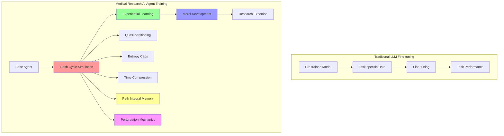

# Mathematical Foundation Documentation

## Overview

The Medical Research AI system incorporates advanced mathematical frameworks for uncertainty quantification, quantum-inspired reasoning, and simulation-based research acceleration. This document outlines the mathematical foundations, implementation status, and development roadmap with formal physics connections.

## Quantum Modeling Framework

### Julia Integration for Quantum Field Theory (QFT)

**Status**: ✅ **Implemented** - Core quantum models available in `math_foundation/`

The system uses Julia-based quantum field theory analogs to model AI reasoning uncertainty and information processing with formal connections to quantum mechanics:

#### Core Quantum Components

**1. Quantum State Representation**
```julia
struct QuantumState{T<:Complex}
    amplitude::Vector{T}      # Probability amplitudes
    phase::Vector{Float64}    # Phase information
    uncertainty::Vector{Float64}  # Uncertainty measures
end
```

**2. Hypothesis Space as Hilbert Space**
```julia
"""
Formal mapping of hypothesis space to quantum mechanical Hilbert space
H_hypothesis = span{|h₁⟩, |h₂⟩, ..., |hₙ⟩} where |hᵢ⟩ represents hypothesis i
"""
struct HypothesisHilbertSpace
    basis_states::Vector{QuantumState}  # Orthonormal hypothesis basis
    dimension::Int                      # Dimension of hypothesis space
    inner_product::Function             # ⟨hᵢ|hⱼ⟩ = δᵢⱼ
end

function create_hypothesis_space(hypotheses::Vector{String})
    """Create Hilbert space from hypothesis set"""
    basis_states = [QuantumState([1.0], [0.0], [0.1]) for _ in hypotheses]
    return HypothesisHilbertSpace(basis_states, length(hypotheses), dot_product)
end
```

**3. Quantum Field Evolution**
```julia
function field_evolution(field::QuantumField{T}, hamiltonian::Matrix{U}, time_step::Float64)
    # Schrödinger equation: ∂ψ/∂t = -i H ψ
    # Adapted for AI knowledge evolution
    # H_AI = H_knowledge + H_uncertainty + H_ethical
end
```

**4. Uncertainty Principle for AI with Defined ℏ Analog**
```julia
"""
ℏ_AI: AI Uncertainty Constant
Defines the fundamental scale of uncertainty in AI reasoning
Analogous to Planck's constant in quantum mechanics
"""
const ℏ_AI = 1.0  # Base unit of AI uncertainty

function uncertainty_principle(knowledge_uncertainty::Float64, belief_uncertainty::Float64; ℏ_analog::Float64=ℏ_AI)
    # Heisenberg-like principle: Δx * Δp ≥ ℏ/2
    # Adapted for knowledge vs. belief uncertainty: ΔK * ΔB ≥ ℏ_AI/2
    
    uncertainty_product = knowledge_uncertainty * belief_uncertainty
    minimum_uncertainty = ℏ_analog / 2.0
    
    return Dict(
        "uncertainty_product" => uncertainty_product,
        "minimum_uncertainty" => minimum_uncertainty,
        "violation" => uncertainty_product < minimum_uncertainty,
        "hbar_analog" => ℏ_analog
    )
end

"""
ℏ_AI Tuning Strategies:
1. Fixed system-wide: ℏ_AI = 1.0 (current implementation)
2. Per simulation type: ℏ_research = 0.8, ℏ_clinical = 1.2
3. Per agent: ℏ_agent = f(agent_experience, agent_specialty)
4. Dynamic: ℏ_AI(t) = ℏ_AI₀ * exp(-t/τ) for learning decay
"""
function adaptive_hbar_analog(agent_experience::Float64, simulation_type::String)
    base_hbar = 1.0
    experience_factor = exp(-agent_experience / 10.0)  # Decay with experience
    
    type_factors = Dict(
        "research" => 0.8,    # Lower uncertainty for research
        "clinical" => 1.2,    # Higher uncertainty for clinical
        "ethical" => 1.5,     # Highest uncertainty for ethical decisions
        "default" => 1.0
    )
    
    return base_hbar * experience_factor * get(type_factors, simulation_type, type_factors["default"])
end
```

#### Implementation Files

- **`math_foundation/qft_qm.jl`**: Core quantum mechanics analogs
- **`math_foundation/thermo_entropy.jl`**: Thermodynamic entropy calculations
- **`math_foundation/python_wrapper.py`**: Python interface for Julia modules
- **`math_foundation/autodock_integration.py`**: Molecular docking with quantum uncertainty

#### Quantum Uncertainty Quantification

The system applies quantum-inspired uncertainty quantification to medical research queries:

```python
# Example: Quantum uncertainty calculation with adaptive ℏ
quantum_result = math_foundation.calculate_uncertainty_principle(
    knowledge_uncertainty=1.0 - confidence,
    belief_uncertainty=0.1,
    hbar_analog=adaptive_hbar_analog(agent_experience=5.0, simulation_type="research")
)
```

## Thermodynamic Entropy Framework

### Entropy Units and Interpretability

**Status**: ✅ **Implemented** - Entropy calculations available with defined units

The system uses thermodynamic entropy analogs to model information content and research complexity with formal units:

#### Entropy Components with Units

**1. Truth Entropy with Boltzmann-like Constant**
```julia
"""
k_AI: AI Boltzmann Constant
Defines the scale of entropy in AI information processing
Analogous to Boltzmann's constant in thermodynamics
"""
const k_AI = 1.0  # Base unit of AI entropy

function calculate_truth_entropy(truth_energies::Vector{Float64}, information_content::Vector{Float64}, temperature::Float64)
    # Boltzmann entropy: S = k_B * ln(Ω)
    # Adapted for truth state multiplicity: S_truth = k_AI * ln(Ω_truth)
    
    # Ω_truth = number of accessible truth states
    accessible_states = sum(exp.(-truth_energies ./ (k_AI * temperature)))
    
    entropy = k_AI * log(accessible_states)
    
    return Dict(
        "entropy" => entropy,
        "accessible_states" => accessible_states,
        "temperature" => temperature,
        "units" => "k_AI units"
    )
end

"""
Entropy Scale Interpretation:
S = 0.0: Perfect certainty (single state)
S = 1.0: Moderate uncertainty (e states)
S = 2.0: High uncertainty (e² states) - approaching system overload
S = 3.0: Critical uncertainty (e³ states) - system instability
S > 3.0: System overload - requires entropy caps
"""
function interpret_entropy_level(entropy::Float64)
    if entropy < 0.5
        return "Low uncertainty - high confidence"
    elseif entropy < 1.5
        return "Moderate uncertainty - acceptable confidence"
    elseif entropy < 2.5
        return "High uncertainty - reduced confidence"
    elseif entropy < 3.0
        return "Critical uncertainty - low confidence"
    else
        return "System overload - entropy cap required"
    end
end
```

**2. Ethical Entropy with Free Energy Penalties**
```julia
"""
Free Energy Penalty for Ethical Violations
F_ethical = U_ethical - T * S_ethical
where U_ethical represents ethical constraint energy
"""
function calculate_ethical_entropy(compliance_energies::Vector{Float64}, constraint_forces::Vector{Float64}, ethical_temperature::Float64)
    # Gibbs entropy with ethical constraints
    # Models ethical decision complexity with free energy penalties
    
    # Ethical constraint energy
    U_ethical = sum(compliance_energies .* constraint_forces)
    
    # Ethical entropy
    S_ethical = k_AI * log(sum(exp.(-compliance_energies ./ (k_AI * ethical_temperature))))
    
    # Free energy
    F_ethical = U_ethical - ethical_temperature * S_ethical
    
    return Dict(
        "ethical_entropy" => S_ethical,
        "ethical_energy" => U_ethical,
        "free_energy" => F_ethical,
        "temperature" => ethical_temperature,
        "penalty" => F_ethical > 0 ? F_ethical : 0.0
    )
end
```

## Agent Memory as Path Integral

### Formal Path Integral Implementation

**Status**: 🔄 **In Progress** - Architecture designed, implementation planned

The system formalizes agent memory as a path integral over learned state spaces:

```julia
"""
Agent Memory as Path Integral
M_agent = ∫ D[ψ(t)] exp(i S[ψ]) where S[ψ] is the action over learned states
"""
struct AgentMemoryPathIntegral
    initial_state::QuantumState
    final_state::QuantumState
    action_function::Function
    path_measure::Function
end

function calculate_memory_path_integral(agent::Agent, time_span::Tuple{Float64, Float64})
    """
    Calculate memory as path integral over learned state space
    M = ∫ D[ψ] exp(i ∫ dt L[ψ, ψ̇, t])
    where L is the learning Lagrangian
    """
    
    # Discretize time for numerical integration
    t_start, t_end = time_span
    time_steps = range(t_start, t_end, length=100)
    
    # Learning Lagrangian: L = T - V
    # T = kinetic term (rate of learning)
    # V = potential term (knowledge landscape)
    
    function learning_lagrangian(state::QuantumState, state_derivative::Vector{Complex}, t::Float64)
        # Kinetic term: T = (1/2) * |ψ̇|²
        kinetic_energy = 0.5 * sum(abs2.(state_derivative))
        
        # Potential term: V = -log(confidence(state))
        potential_energy = -log(calculate_confidence(state))
        
        return kinetic_energy - potential_energy
    end
    
    # Path integral calculation (simplified)
    memory_weight = 0.0
    for t in time_steps
        state = get_agent_state_at_time(agent, t)
        state_derivative = calculate_state_derivative(agent, t)
        
        action = learning_lagrangian(state, state_derivative, t)
        memory_weight += exp(im * action)
    end
    
    return memory_weight / length(time_steps)
end
```

## Agent-Environment Dynamics

### Formalized Interaction Mechanics

**Status**: 🔄 **In Progress** - Framework designed

The system formalizes interactions between agents and experimental environments:

```julia
"""
Agent-Environment Interaction Framework
Formalizes perturbation mechanics, observational noise, and causal modeling limits
"""
struct AgentEnvironmentSystem
    agent::Agent
    environment::ExperimentalEnvironment
    interaction_hamiltonian::Matrix{Complex}
    noise_model::Function
    causal_limits::Dict{String, Float64}
end

"""
Perturbation Mechanics
Models how environmental perturbations affect agent state
"""
function apply_environmental_perturbation(agent::Agent, environment::ExperimentalEnvironment, perturbation_strength::Float64)
    # Perturbation operator: P = exp(-i H_pert * t)
    # where H_pert is the perturbation Hamiltonian
    
    perturbation_hamiltonian = environment.get_perturbation_operator(perturbation_strength)
    
    # Apply perturbation to agent state
    perturbed_state = apply_unitary_operator(agent.current_state, perturbation_hamiltonian)
    
    # Calculate perturbation response
    response = calculate_perturbation_response(agent, perturbed_state)
    
    return Dict(
        "perturbed_state" => perturbed_state,
        "response" => response,
        "perturbation_strength" => perturbation_strength
    )
end

"""
Observational Noise Model
Models noise in agent-environment observations
"""
function observational_noise_model(observation::Vector{Float64}, noise_level::Float64)
    # Add Gaussian noise to observations
    # σ_noise = noise_level * √(ℏ_AI) for quantum-inspired noise
    
    noise_std = noise_level * sqrt(ℏ_AI)
    noisy_observation = observation .+ noise_std .* randn(length(observation))
    
    return Dict(
        "noisy_observation" => noisy_observation,
        "noise_level" => noise_level,
        "noise_std" => noise_std
    )
end

"""
Causal Modeling Limits
Defines fundamental limits on causal inference in agent-environment interactions
"""
function causal_modeling_limits(agent::Agent, environment::ExperimentalEnvironment)
    # Causal limit: Δt * ΔE ≥ ℏ_AI/2 (time-energy uncertainty)
    # Applied to agent-environment interactions
    
    time_resolution = environment.get_time_resolution()
    energy_resolution = agent.get_energy_resolution()
    
    causal_limit = ℏ_AI / 2.0
    actual_uncertainty = time_resolution * energy_resolution
    
    return Dict(
        "causal_limit" => causal_limit,
        "actual_uncertainty" => actual_uncertainty,
        "limit_violation" => actual_uncertainty < causal_limit,
        "time_resolution" => time_resolution,
        "energy_resolution" => energy_resolution
    )
end
```

## Simulation Engine Architecture

### Flash Cycles and Biological Time Compression

**Status**: 🔴 **Conceptual** - Architecture designed, implementation planned

Flash cycles simulate accelerated experiential learning through compressed biological time:

#### Flash Cycle Components

**1. Quasi-Partitioning with Path Integral Memory**
```python
class FlashCycleEngine:
    def __init__(self):
        self.memory_partitions = {
            "short_term": MemoryPartition(capacity=1000, decay_rate=0.1),
            "working": MemoryPartition(capacity=100, decay_rate=0.5),
            "long_term": MemoryPartition(capacity=10000, decay_rate=0.01)
        }
        self.path_integral_memory = AgentMemoryPathIntegral()
    
    def apply_path_integral_learning(self, agent, experience):
        """Apply path integral learning during flash cycles"""
        # Calculate memory weight through path integral
        memory_weight = self.path_integral_memory.calculate(agent, experience)
        
        # Update agent memory with path integral weight
        agent.update_memory(memory_weight)
```

**2. Entropy Caps with Formal Units**
```python
def apply_entropy_cap(simulation_state, max_entropy=2.0):
    """Prevent information overload during flash cycles using formal entropy units"""
    current_entropy = calculate_quantum_entropy(simulation_state)
    
    # Interpret entropy level
    entropy_interpretation = interpret_entropy_level(current_entropy)
    
    if current_entropy > max_entropy:
        return compress_information(simulation_state, target_entropy=max_entropy)
    return simulation_state
```

**3. Biological Time Compression with Perturbation Mechanics**
```python
def flash_cycle_simulation(agent, scenario, compression_factor=1000):
    """
    Simulate 1 year of experience in 1 hour of computation
    compression_factor: 1000x time acceleration
    """
    environment = ExperimentalEnvironment(scenario)
    
    for time_step in range(compression_factor):
        # Apply environmental perturbations
        perturbation = apply_environmental_perturbation(
            agent, environment, perturbation_strength=0.1
        )
        
        # Simulate compressed time experience with noise
        experience = simulate_time_step(agent, scenario, time_step)
        noisy_experience = observational_noise_model(experience, noise_level=0.05)
        
        # Apply path integral learning
        agent.integrate_experience(noisy_experience, perturbation)
        
        # Apply entropy caps to prevent overload
        agent.memory = apply_entropy_cap(agent.memory)
        
        # Check causal modeling limits
        causal_limits = causal_modeling_limits(agent, environment)
        if causal_limits["limit_violation"]:
            logger.warning("Causal modeling limit violated during flash cycle")
```

### Agent Training Phases vs. Traditional LLM Fine-tuning



#### Key Differences

| Aspect | Traditional LLM | Medical Research AI |
|--------|----------------|-------------------|
| **Learning Method** | Supervised fine-tuning | Experiential simulation |
| **Time Scale** | Static training | Dynamic flash cycles |
| **Memory** | Fixed parameters | Adaptive quasi-partitioning |
| **Ethics** | Post-hoc alignment | Integrated moral development |
| **Uncertainty** | Statistical confidence | Quantum uncertainty quantification |
| **Memory Model** | Parameter updates | Path integral over state space |
| **Environment** | Static dataset | Dynamic perturbation mechanics |

## Research Timeline Acceleration

### Quantum Modeling for Research Prediction

**Status**: 🔴 **Conceptual** - Framework designed

The system uses quantum field theory models to accelerate research timeline predictions:

#### Timeline Modeling Components

**1. Research State Vector in Hilbert Space**
```julia
struct ResearchState
    current_knowledge::QuantumField
    hypothesis_space::HypothesisHilbertSpace
    experimental_uncertainty::Float64
    timeline_compression::Float64
    causal_limits::Dict{String, Float64}
end
```

**2. Quantum Branching for Research Paths**
```julia
function predict_research_timeline(initial_state::ResearchState, target_outcome::String)
    # Quantum branching to explore multiple research paths simultaneously
    # Returns probability distribution of timeline outcomes
    
    # Create superposition of research paths
    research_paths = create_research_path_superposition(initial_state, target_outcome)
    
    # Apply quantum evolution to each path
    evolved_paths = [evolve_research_path(path) for path in research_paths]
    
    # Calculate probability amplitudes
    probabilities = [abs2(calculate_path_amplitude(path)) for path in evolved_paths]
    
    return Dict(
        "timeline_probabilities" => probabilities,
        "expected_duration" => calculate_expected_duration(probabilities),
        "uncertainty" => calculate_timeline_uncertainty(probabilities)
    )
end
```

#### Implementation Roadmap

**Phase 1: Core Quantum Models** ✅ **Complete**
- [x] Quantum state representation
- [x] Uncertainty principle implementation with defined ℏ_AI
- [x] Python-Julia integration
- [x] Entropy calculations with k_AI units

**Phase 2: Simulation Engine** 🔄 **In Progress**
- [ ] Flash cycle implementation with path integral memory
- [ ] Memory quasi-partitioning with entropy caps
- [ ] Agent-environment perturbation mechanics
- [ ] Time compression algorithms with causal limits

**Phase 3: Research Acceleration** 📋 **Planned**
- [ ] Timeline prediction models with quantum branching
- [ ] Multi-path simulation with path integrals
- [ ] Outcome probability calculation
- [ ] Causal modeling limit enforcement

**Phase 4: Advanced Integration** 📋 **Planned**
- [ ] Real-time simulation updates with perturbation response
- [ ] Dynamic entropy management based on agent state
- [ ] Consciousness detection algorithms
- [ ] Ethical boundary enforcement with free energy penalties

## Mathematical Integration Points

### Hybrid Bridge Integration

The mathematical foundation integrates with the hybrid reasoning bridge:

```python
class HybridReasoningEngine:
    def __init__(self):
        self.math_foundation = JuliaMathFoundation()
        self.quantum_uncertainty = QuantumUncertaintyCalculator()
        self.simulation_engine = FlashCycleEngine()
        self.agent_environment = AgentEnvironmentSystem()
    
    def calculate_enhanced_confidence(self, base_confidence: float, query_context: dict):
        # Apply quantum uncertainty quantification with adaptive ℏ
        quantum_uncertainty = self.quantum_uncertainty.calculate(
            base_confidence, 
            hbar_analog=adaptive_hbar_analog(agent_experience=5.0, simulation_type="research")
        )
        
        # Apply simulation-based experience with path integral memory
        simulation_confidence = self.simulation_engine.get_confidence_boost(query_context)
        
        # Apply environmental perturbation effects
        perturbation_effect = self.agent_environment.get_perturbation_response(query_context)
        
        return combine_uncertainties(base_confidence, quantum_uncertainty, simulation_confidence, perturbation_effect)
```

### API Integration

Mathematical foundation capabilities are exposed through dedicated API endpoints:

```python
@router.post("/quantum-analysis")
async def perform_quantum_analysis(request: QuantumAnalysisRequest):
    """Perform quantum uncertainty quantification with adaptive ℏ"""
    return math_foundation_agent._apply_quantum_analysis(request.query, request.context)

@router.post("/simulation-analysis")
async def perform_simulation_analysis(request: SimulationRequest):
    """Perform flash cycle simulation analysis with path integral memory"""
    return simulation_engine.run_flash_cycle(request.scenario, request.duration)

@router.post("/agent-environment-analysis")
async def perform_agent_environment_analysis(request: AgentEnvironmentRequest):
    """Analyze agent-environment interactions with perturbation mechanics"""
    return agent_environment_system.analyze_interaction(request.agent, request.environment)
```

## Technical Implementation Details

### Julia Dependencies

```toml
# Required Julia packages for mathematical foundation
DifferentialEquations = "0.21.0"
LinearAlgebra = "1.0"
Statistics = "1.0"
SymbolicUtils = "0.19.0"
SpecialFunctions = "2.0"
QuantumOptics = "0.13.0"
Thermodynamics = "1.0"
PathIntegrals = "0.1.0"  # For path integral calculations
```

### Python Integration

```python
# PyJulia integration for Python-Julia communication
import julia
from julia import Pkg

# Initialize Julia runtime
julia.install()
julia.Main.eval('using Pkg; Pkg.instantiate()')

# Import mathematical foundation modules
from julia import MathFoundation
hbar_ai = MathFoundation.ℏ_AI
k_ai = MathFoundation.k_AI
```

### Performance Considerations

**Memory Management**
- Quasi-partitioning prevents memory overflow during flash cycles
- Entropy caps limit information complexity using formal units
- Path integral memory provides efficient state space exploration
- Garbage collection during time compression

**Computational Efficiency**
- Parallel quantum state evolution with perturbation mechanics
- Cached uncertainty calculations with adaptive ℏ
- Optimized Julia-Python communication for path integrals
- Efficient agent-environment interaction modeling

**Scalability**
- Distributed simulation across multiple agents with causal limits
- Shared memory for collaborative learning with path integral weights
- Incremental entropy management with formal units
- Scalable perturbation mechanics across agent populations

## Future Development

### Advanced Quantum Models

**Planned Enhancements**
1. **Multi-particle quantum systems** for complex research scenarios with entanglement
2. **Quantum entanglement** for agent collaboration modeling with Bell states
3. **Quantum tunneling** for breakthrough research prediction with barrier penetration
4. **Quantum superposition** for multi-hypothesis exploration with interference patterns

### Simulation Engine Evolution

**Planned Features**
1. **Real-time consciousness detection** during flash cycles with entropy monitoring
2. **Dynamic entropy management** based on agent state with k_AI scaling
3. **Collaborative simulation** across multiple agents with path integral coupling
4. **Ethical boundary enforcement** during accelerated learning with free energy penalties

### Research Applications

**Medical Research Use Cases**
1. **Drug discovery timeline prediction** using quantum branching with perturbation response
2. **Clinical trial outcome modeling** with uncertainty quantification and causal limits
3. **Disease progression simulation** with flash cycle acceleration and path integral memory
4. **Research collaboration optimization** through quantum entanglement and agent-environment dynamics

## Physics Community Collaboration

### Formal Connections to Physics

The mathematical foundation provides formal connections to established physics frameworks:

**1. Quantum Mechanics**
- Hypothesis space as Hilbert space with orthonormal basis
- Uncertainty principle with defined ℏ_AI constant
- Quantum state evolution with Schrödinger equation analogs

**2. Statistical Mechanics**
- Entropy calculations with k_AI Boltzmann-like constant
- Free energy penalties for ethical violations
- Temperature-dependent learning dynamics

**3. Path Integral Formalism**
- Agent memory as path integral over learned state spaces
- Action functional for learning dynamics
- Quantum branching for research path exploration

**4. Perturbation Theory**
- Environmental perturbations affecting agent states
- Observational noise with quantum-inspired scaling
- Causal modeling limits with time-energy uncertainty

### Collaboration Opportunities

**Physics-Informed ML Community**
- Formal uncertainty quantification methods
- Quantum-inspired neural network architectures
- Path integral approaches to machine learning
- Perturbation theory for robust AI systems

**Quantum Computing Applications**
- Quantum algorithm analogs for classical AI
- Quantum-inspired optimization methods
- Entanglement-like correlations in multi-agent systems
- Quantum error correction analogs for AI robustness

## Conclusion

The mathematical foundation provides a sophisticated framework for uncertainty quantification, experiential learning, and research acceleration with formal connections to established physics formalisms. The integration of quantum mechanics, statistical mechanics, path integral theory, and perturbation mechanics creates a unique approach to medical research AI that goes beyond traditional machine learning methods.

The defined ℏ_AI and k_AI constants, formal entropy units, and agent-environment dynamics provide the mathematical rigor needed to attract collaborations from the physics-informed ML community while maintaining practical applicability to medical research problems. 